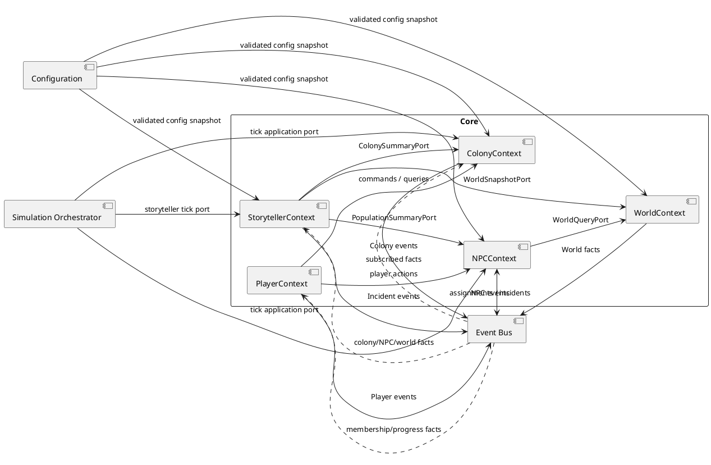

# RimWorldCraft — Bounded Contexts

## 1. Введение

Этот документ детализирует раздел «Ограниченные контексты» из [`system-overview.md`](system-overview.md). Его назначение — зафиксировать границы ответственности, модели данных, публичные контракты и правила взаимодействия доменных областей RimWorldCraft.

Документ является практическим соглашением для разработки: по нему формируются пакеты, интерфейсы портов, события, тестовые наборы и ArchUnit-проверки. Если новая функциональность неочевидно принадлежит одному контексту, сначала определяется её владелец здесь, а затем создаётся ADR при необходимости.

### Архитектурная позиция

RimWorldCraft использует bounded contexts внутри единого доменного Core. Контексты не являются автоматически отдельными процессами или Minecraft-модами. Их главная цель — ограничить язык, владение данными и направление зависимостей.

- Каждый контекст владеет своими агрегатами и инвариантами.
- Контекст публикует факты через domain events и предоставляет application ports.
- Внутренние классы контекста не являются API для соседей.
- Minecraft API находится только в адаптерах за пределами Core.
- Общие данные передаются как стабильные идентификаторы и integration DTO, а не как ссылки на чужие агрегаты.

### Как документ влияет на код

Базовый namespace: `com.rimworldcraft`.

Каждый контекст получает собственный пакет:

```text
com.rimworldcraft.core.colony
com.rimworldcraft.core.npc
com.rimworldcraft.core.storyteller
com.rimworldcraft.core.world
com.rimworldcraft.core.player
```

Рекомендуемая внутренняя структура:

```text
<context>/
  domain/          # Aggregate Roots, entities, value objects, policies
  application/     # commands, queries, use cases, handlers
  port/in/         # входящие application ports
  port/out/        # исходящие порты, требуемые контекстом
  event/           # собственные domain events и handlers
  contract/        # публичные integration DTO, если нужны
```

`domain` не зависит от `application`; `application` может зависеть от `domain` и собственных портов. Публичные межконтекстные контракты должны быть минимальными и версионируемыми.

## 2. Общая карта контекстов

### Роли контекстов

**Основные доменные контексты:**

- `ColonyContext` — коллективная жизнь и ресурсы поселения;
- `NPCContext` — индивидуальные персонажи, потребности и задачи;
- `StorytellerContext` — темп истории и генерация происшествий;
- `WorldContext` — абстракция пригодности мира, климата, ресурсов и угроз;
- `PlayerContext` — игрок, членство, права и настройки управления.

**Вспомогательные технические области:**

- `Configuration` — загрузка и валидация JSON, не владеет игровыми агрегатами;
- `Simulation Orchestrator` — координирует tick и вызовы application ports, не содержит бизнес-состояния;
- `Integration/Event Contracts` — только стабильные envelope и DTO, не самостоятельный доменный владелец.

### Context Map



Диаграмма показывает логические отношения. Стрелки к `Event Bus` не означают, что контексты зависят от реализации Minecraft event bus: они зависят только от `EventBusPort` и event contracts.

### Сводная таблица владения

| Контекст | Главный агрегат | Владеет | Не владеет |
|---|---|---|---|
| Colony | `Colony` | состав, ресурсы, зоны, work priorities, колониальные цели | внутренним состоянием NPC, Minecraft blocks |
| NPC | `Npc` | needs, skills, traits, health, current job | запасами колонии и историей incidents |
| Storyteller | `Storyteller` | pacing, cooldowns, incident selection | непосредственным spawn entity и ресурсами |
| World | `WorldRegion` | абстрактными facts карты, климатом и доступностью | полной Minecraft-картой и сущностями |
| Player | `PlayerProfile` | членством, правами, прогрессом, preferences | колониальным состоянием и auth Minecraft |

## 3. Общие данные и идентификаторы

### Канонические идентификаторы

Контексты никогда не передают друг другу aggregate object. Они используют следующие value objects:

| Идентификатор | Формат/смысл | Канонический владелец | Где может использоваться |
|---|---|---|---|
| `WorldId` | стабильный идентификатор игрового мира | World adapter / World context boundary | все контексты как scope |
| `ColonyId` | UUID колонии | Colony | Player, NPC, Storyteller |
| `NpcId` | UUID NPC, стабильный в save data | NPC | Colony membership, Storyteller summaries, Player UI |
| `PlayerId` | внешний UUID игрока | Player boundary/Minecraft identity adapter | commands, membership, audit |
| `RegionId` | логический регион карты | World | Colony site, Storyteller |
| `IncidentId` | UUID конкретного происшествия | Storyteller | Colony/NPC notifications |
| `ContentId` | стабильный JSON id | Configuration/content owner | traits, jobs, incidents, climates |

### Правила передачи данных

1. `NpcId`, `ColonyId`, `PlayerId`, `WorldId` и `RegionId` передаются как immutable value objects или сериализуемые strings в integration DTO.
2. Соседний контекст получает только минимальную проекцию: например, `NpcSummary`, а не `Npc`.
3. Координаты представлены независимым от Minecraft `GridPosition(x, y, z)` плюс `WorldId`; `BlockPos`, `Level` и `Entity` запрещены в Core.
4. Внешние Minecraft UUID адаптер преобразует в `PlayerId`/`NpcId`; домен не зависит от способа генерации UUID.
5. Ссылки на отсутствующий идентификатор обрабатываются как доменная ошибка или eventual consistency case, но не как `null`-доступ к чужому объекту.
6. Event envelope содержит `eventId`, `eventType`, `schemaVersion`, `occurredAt`, `worldId`, `correlationId` и payload.

### Общие kernel-контракты

Допустим небольшой Shared Kernel в `core.shared`:

```text
WorldId, ColonyId, NpcId, PlayerId, RegionId
GameTick, GridPosition, TimeWindow
DomainEvent, EventEnvelope
DomainError, Result
```

Shared Kernel не должен включать `Colony`, `Npc`, `Storyteller`, репозитории, конфигурационные модели или Minecraft-типы. Изменение Shared Kernel требует проверки всех контекстов и, если меняется семантика, ADR.

## 4. ColonyContext

### 4.1 Идентичность и пакет

- **Имя:** `ColonyContext`
- **Пакет:** `com.rimworldcraft.core.colony`
- **Главный агрегат:** `Colony`
- **Поддерживающий язык:** colony, colonist membership, stockpile, work policy, zone, settlement, morale of the group.

### 4.2 Ответственность

`ColonyContext` моделирует поселение как управляемое коллективное образование. Он принимает решения о составе и общих правилах колонии, распределении ресурсов, рабочих приоритетах, зонах и коллективных целях.

Контекст отвечает за проверку колониальных инвариантов: уникальность membership, допустимость назначения работы, наличие ресурсов для коллективной операции и жизненный цикл поселения.

### 4.3 Агрегаты и составные части

#### `Colony` — Aggregate Root

Состав:

- `ColonyId id`;
- `WorldId worldId`;
- `ColonyName name`;
- `SettlementSite site`;
- `ColonyStatus status`;
- `Set<ColonistMembership> members`;
- `InventoryLedger inventory`;
- `WorkPolicy workPolicy`;
- `Set<WorkZone> zones`;
- `ColonyObjectives objectives`;
- `MoraleSnapshot morale`;
- `ColonyWealth wealth`.

Сущности:

- `ColonistMembership` — отношение `NpcId` к колонии, роль и дата вступления;
- `WorkZone` — именованная область и разрешённые типы работ;
- `ColonyObjective` — коллективная цель и прогресс.

Value objects:

- `ColonyName`, `SettlementSite`, `ResourceAmount`, `ResourceType`, `WorkPriority`, `MoraleScore`, `WealthValue`, `MembershipRole`.

`Npc` не является дочерней entity агрегата `Colony`. Колония хранит только `NpcId` и membership metadata, чтобы не создавать огромную транзакционную границу.

### 4.4 Границы

**Входит:**

- основание, переименование, пауза и разрушение колонии;
- membership NPC;
- запасы и ledger коллективных ресурсов;
- зоны, work priorities и коллективные цели;
- расчёт colony-level morale/wealth summaries;
- применение результатов производства или потребления.

**Категорически не входит:**

- потребности, здоровье, traits и текущий job конкретного NPC;
- генерация рейдов и выбор incident;
- чтение/изменение Minecraft blocks напрямую;
- authentication игрока;
- физическое перемещение entities.

### 4.5 Доменные события

- `ColonyFounded`
- `ColonyRenamed`
- `ColonistJoined`
- `ColonistLeft`
- `WorkAssigned`
- `WorkPolicyChanged`
- `ResourceReserved`
- `ResourceConsumed`
- `ResourceProduced`
- `ColonyMoraleChanged`
- `ColonyObjectiveCompleted`
- `ColonyThreatMarked`
- `ColonyDestroyed`

Минимальный payload `ColonistJoined`:

```json
{
  "eventType": "ColonistJoined",
  "schemaVersion": 1,
  "worldId": "frontier",
  "colonyId": "8c3b...",
  "npcId": "0d72...",
  "membershipRole": "COLONIST"
}
```

### 4.6 Порты

**Входящие:**

- `CreateColonyUseCase`;
- `RenameColonyUseCase`;
- `AssignWorkUseCase`;
- `ManageColonyZoneUseCase`;
- `ApplyProductionResultUseCase`;
- `ApplyIncidentImpactUseCase`;
- `GetColonyView`;
- `GetColonySummaryPort` — входящий query contract для Storyteller.

**Исходящие:**

- `ColonyRepository`;
- `EventBusPort`;
- `ClockPort`;
- `ConfigurationPort<ColonyConfigSnapshot>`;
- `NpcSummaryPort` — только если требуется проверка eligibility membership, возвращает read-only summaries;
- `WorldSettlementPort` — проверить site/ownership через абстрактный контракт.

### 4.7 Ключевые сценарии

#### Основание поселения

1. `CreateColonyUseCase` валидирует `PlayerId`, имя и `WorldId`.
2. `WorldSettlementPort` проверяет участок.
3. `Colony` создаётся с starter package из конфигурации.
4. `ColonyFounded` публикуется после успешного сохранения.
5. Player context получает факт и создаёт membership игрока через собственный use case.

#### Назначение работы

1. Команда содержит `ColonyId`, `NpcId`, `WorkTypeId`, `PlayerId`, `commandId`.
2. Проверяются права игрока и членство NPC.
3. `WorkPolicy` обновляет приоритет.
4. Публикуется `WorkAssigned`.
5. NPC context принимает событие и обновляет доступное намерение job.

### 4.8 JSON-схемы

```text
config/rimworldcraft/colony/starting-packages.json
config/rimworldcraft/colony/work-types.json
config/rimworldcraft/colony/resource-definitions.json
config/rimworldcraft/colony/objectives.json
```

## 5. NPCContext

### 5.1 Идентичность и пакет

- **Имя:** `NPCContext`
- **Пакет:** `com.rimworldcraft.core.npc`
- **Главный агрегат:** `Npc`
- **Поддерживающий язык:** needs, skills, traits, health, job, incapacitation, pawn-like behavior.

### 5.2 Ответственность

Контекст моделирует индивидуальное состояние NPC и превращает колониальные назначения в исполнимые job intentions. Он обновляет needs, настроение, здоровье и жизненный цикл NPC, но не распоряжается запасами колонии напрямую.

### 5.3 Агрегаты и составные части

#### `Npc` — Aggregate Root

Состав:

- `NpcId id`;
- `WorldId worldId`;
- `ColonyId colonyId` — nullable только для независимых/враждебных NPC через явный статус;
- `NpcName name`;
- `NpcStatus status`;
- `NeedState needs`;
- `SkillSet skills`;
- `TraitSet traits`;
- `HealthState health`;
- `MoodState mood`;
- `JobAssignment currentJob`;
- `NpcSchedule schedule`.

Сущности:

- `Need` с типом, текущим значением и decay policy;
- `Skill` с уровнем и progression;
- `HealthCondition`;
- `JobAssignment` и `JobAttempt`.

Value objects:

- `NpcId`, `NpcName`, `NeedType`, `NeedLevel`, `SkillType`, `SkillLevel`, `TraitId`, `MoodScore`, `DamageAmount`, `JobTypeId`, `JobPriority`.

### 5.4 Границы

**Входит:**

- состояние individual needs, mood, health;
- навыки, traits и modifiers;
- выбор и lifecycle задачи;
- переходы `AVAILABLE`, `WORKING`, `RESTING`, `INCAPACITATED`, `DEAD`;
- индивидуальные реакции на события.

**Не входит:**

- владение запасами и списание ресурсов;
- постановка общих work priorities колонии;
- поиск реальных Minecraft path nodes и управление entity;
- генерация incident;
- player permissions.

### 5.5 Доменные события

- `NpcSpawned`
- `NpcJoinedColony`
- `NeedThresholdReached`
- `MoodChanged`
- `JobAccepted`
- `JobStarted`
- `JobProgressed`
- `JobCompleted`
- `JobFailed`
- `NpcIncapacitated`
- `NpcRecovered`
- `NpcDied`
- `TraitApplied`
- `SkillImproved`

Событие `JobCompleted` содержит `JobTypeId`, `NpcId`, `ColonyId`, `outputIntent` и не изменяет inventory самостоятельно. Colony context решает, как применить результат.

### 5.6 Порты

**Входящие:**

- `AdvanceNpcSimulationUseCase`;
- `AssignNpcJobUseCase`;
- `ApplyDamageUseCase`;
- `ApplyNeedEffectUseCase`;
- `GetNpcView`;
- `GetPopulationSummary`.

**Исходящие:**

- `NpcRepository`;
- `WorldQueryPort` — path feasibility, hazards, target facts;
- `EventBusPort`;
- `ClockPort`;
- `RandomPort`;
- `ConfigurationPort<NpcConfigSnapshot>`;
- `JobExecutionIntentPort` — выдача намерения адаптеру, а не вызов Minecraft entity.

### 5.7 Ключевые сценарии

#### Обновление настроения

1. Tick service загружает `Npc`.
2. `NeedDecayPolicy` обновляет hunger/rest/recreation.
3. `MoodPolicy` применяет traits и environment modifiers.
4. Если пересечён threshold, публикуются `NeedThresholdReached` и `MoodChanged`.
5. Storyteller получает факт через event bus и может изменить вероятность incident.

#### Выполнение назначенной работы

1. NPC получает `WorkAssigned` с `ColonyId`, `NpcId` и `WorkTypeId`.
2. Проверяет доступность, health, priority и prerequisites.
3. Запрашивает у `WorldQueryPort` достижимость цели.
4. Публикует `JobStarted` и выдаёт `JobExecutionIntent`.
5. После результата адаптера публикует `JobCompleted` или `JobFailed`.

### 5.8 JSON-схемы

```text
config/rimworldcraft/npc/traits.json
config/rimworldcraft/npc/needs.json
config/rimworldcraft/npc/jobs.json
config/rimworldcraft/npc/skills.json
config/rimworldcraft/npc/health-effects.json
```

## 6. StorytellerContext

### 6.1 Идентичность и пакет

- **Имя:** `StorytellerContext`
- **Пакет:** `com.rimworldcraft.core.storyteller`
- **Главный агрегат:** `Storyteller`
- **Поддерживающий язык:** incidents, threat points, pacing, storyteller policy, cooldown, adaptation.

### 6.2 Ответственность

Контекст управляет темпом истории: выбирает, когда и какое происшествие возможно, учитывая конфигурацию, состояние мира, колонии и population summary. Он создаёт решение о происшествии, но не спаунит Minecraft entities и не меняет чужие агрегаты напрямую.

### 6.3 Агрегаты и составные части

#### `Storyteller` — Aggregate Root

Состав:

- `StorytellerId id`;
- `WorldId worldId`;
- `StorytellerProfile profile`;
- `ThreatBudget threatBudget`;
- `IncidentCooldowns cooldowns`;
- `PacingState pacing`;
- `RecentIncidentHistory history`.

Сущности:

- `IncidentRecord`;
- `IncidentCandidate`;
- `DifficultyBand`.

Value objects:

- `ThreatPoints`, `IncidentId`, `IncidentTypeId`, `IncidentWeight`, `Cooldown`, `DifficultyLevel`, `PacingScore`, `EligibilityWindow`.

### 6.4 Границы

**Входит:**

- eligibility и weighting incidents;
- расчёт threat points и difficulty;
- cooldown и pacing;
- выбор faction pool и incident parameters;
- публикация intent/fact о запланированном происшествии.

**Не входит:**

- фактическое создание hostile entities;
- изменение ресурсов, здоровья или настроения напрямую;
- pathfinding и поиск spawn point без World port;
- чтение внутренних классов Colony/NPC;
- визуальное уведомление игрока напрямую.

### 6.5 Доменные события

- `IncidentEvaluated`
- `IncidentScheduled`
- `RaidGenerated`
- `RaidCancelled`
- `FireIncidentGenerated`
- `WeatherIncidentGenerated`
- `RewardIncidentGenerated`
- `StorytellerPressureChanged`

`RaidGenerated` содержит `IncidentId`, `WorldId`, `ColonyId`, `threatPoints`, `factionId`, `entryRegionId` и набор spawn intents. Он не содержит `ServerLevel`, `EntityType` или Minecraft coordinates types.

### 6.6 Порты

**Входящие:**

- `AdvanceStorytellerUseCase`;
- `EvaluateIncidentUseCase`;
- `GetStorytellerView`;
- `ApplyIncidentOutcomeUseCase` — для подтверждения результата.

**Исходящие:**

- `StorytellerRepository`;
- `ColonySummaryPort`;
- `PopulationSummaryPort`;
- `WorldSnapshotPort`;
- `ConfigurationPort<StorytellerConfigSnapshot>`;
- `RandomPort`;
- `ClockPort`;
- `EventBusPort`;
- `IncidentExecutionIntentPort` — для инфраструктуры.

### 6.7 Ключевые сценарии

#### Оценка происшествия

1. `AdvanceStorytellerUseCase` получает tick.
2. Загружаются summaries через публичные query ports.
3. Фильтруются incidents по условиям конфигурации и cooldown.
4. `RandomPort` выбирает weighted candidate с seed мира.
5. `WorldSnapshotPort` предоставляет допустимые регионы.
6. `IncidentScheduled` или `RaidGenerated` сохраняется и публикуется.

#### Отложенный рейд

Если нет допустимой точки входа или колония находится в неподходящем состоянии, Storyteller публикует `RaidCancelled` с причиной и сохраняет retry window. Он не вызывает NPC/Colony методы напрямую.

### 6.8 JSON-схемы

```text
config/rimworldcraft/storyteller/incidents.json
config/rimworldcraft/storyteller/difficulty-curves.json
config/rimworldcraft/storyteller/faction-pools.json
config/rimworldcraft/storyteller/pacing.json
```

## 7. WorldContext

### 7.1 Идентичность и пакет

- **Имя:** `WorldContext`
- **Пакет:** `com.rimworldcraft.core.world`
- **Главный агрегат:** `WorldRegion` / `MapSnapshot`
- **Поддерживающий язык:** region, terrain facts, climate, resource node, hazard, accessibility.

### 7.2 Ответственность

World context формирует минимальную доменную модель окружения, необходимую Core. Minecraft остаётся владельцем полного физического мира; World context не пытается копировать всю карту.

Контекст отвечает за абстрактные факты: пригодность участка, климат, доступность пути, наличие ресурсов, опасности, региональные условия и изменения погоды, если они значимы для правил колонии.

### 7.3 Агрегаты и составные части

#### `WorldRegion` — Aggregate Root

Состав:

- `RegionId id`;
- `WorldId worldId`;
- `RegionBounds bounds`;
- `ClimateProfile climate`;
- `TerrainSnapshot terrain`;
- `ResourceCatalog resources`;
- `HazardState hazards`;
- `DiscoveryState discovery`;
- `WorldTick lastObservedTick`.

Сущности:

- `ResourceNode`;
- `HazardZone`;
- `WeatherCell`;
- `SettlementSiteCandidate`.

Value objects:

- `GridPosition`, `RegionBounds`, `BiomeId`, `ClimateId`, `Temperature`, `Humidity`, `ResourceType`, `ResourceAmount`, `PathCost`, `HazardLevel`, `Accessibility`.

### 7.4 Границы

**Входит:**

- доменные facts о terrain и climate;
- проверка пригодности settlement site;
- path/accessibility query;
- абстрактное обнаружение ресурсов и опасностей;
- публикация значимых world changes.

**Не входит:**

- полный Minecraft `Level`, chunk loading и block mutation;
- владение колонией или NPC entity;
- выбор storyteller incident;
- rendering и client map UI;
- долгосрочное хранение каждого блока мира.

### 7.5 Доменные события

- `RegionDiscovered`
- `SettlementSiteValidated`
- `ResourceLocated`
- `ThreatDetected`
- `HazardChanged`
- `WeatherChanged`
- `PathAvailabilityChanged`

### 7.6 Порты

**Входящие:**

- `ObserveWorldTickUseCase`;
- `RefreshRegionSnapshotUseCase`;
- `ValidateSettlementSiteUseCase`;
- `GetWorldSnapshot`.

**Исходящие:**

- `MinecraftWorldObservationPort`;
- `WorldSnapshotRepository`;
- `EventBusPort`;
- `ClockPort`;
- `ConfigurationPort<WorldConfigSnapshot>`.

`MinecraftWorldObservationPort` может иметь реализацию `MinecraftWorldAdapter`, но интерфейс возвращает только `TerrainFact`, `ClimateFact`, `PathResult` и другие Core types.

### 7.7 Ключевые сценарии

#### Проверка места основания

1. Colony передаёт `WorldId` и `GridPosition` через `WorldSettlementPort`.
2. World adapter читает blocks/biome/height через Minecraft API.
3. Преобразованные facts проверяются policy.
4. Возвращается `SettlementValidationResult`.
5. При успехе публикуется `SettlementSiteValidated`.

#### Поиск точки входа рейда

1. Storyteller запрашивает candidates в заданном регионе.
2. World context фильтрует опасные/недоступные позиции.
3. Возвращает независимые от Minecraft `SpawnEntryPoint`.
4. Infrastructure adapter материализует intent в Minecraft.

### 7.8 JSON-схемы

```text
config/rimworldcraft/world/climates.json
config/rimworldcraft/world/resources.json
config/rimworldcraft/world/hazards.json
config/rimworldcraft/world/settlement-rules.json
```

## 8. PlayerContext

### 8.1 Идентичность и пакет

- **Имя:** `PlayerContext`
- **Пакет:** `com.rimworldcraft.core.player`
- **Главный агрегат:** `PlayerProfile`
- **Поддерживающий язык:** player membership, permissions, control mode, milestones, preferences.

### 8.2 Ответственность

Контекст связывает Minecraft identity с доменными правами игрока в RimWorldCraft. Он хранит, какими колониями управляет игрок, какие действия ему разрешены, какой режим управления выбран и какой прогресс разблокирован.

Minecraft authentication остаётся внешней ответственностью. Player context доверяет только нормализованному `PlayerId`, полученному из server-side adapter.

### 8.3 Агрегаты и составные части

#### `PlayerProfile` — Aggregate Root

Состав:

- `PlayerId id`;
- `WorldId worldId`;
- `Set<ColonyMembership>`;
- `PermissionSet permissions`;
- `ControlMode controlMode`;
- `PlayerPreferences preferences`;
- `ProgressionState progression`;
- `LastKnownSelection selection`.

Сущности:

- `ColonyMembership`;
- `UnlockedMilestone`;
- `PlayerCommandRecord` для idempotency/audit.

Value objects:

- `PlayerId`, `Permission`, `ControlMode`, `HudPreference`, `SelectedNpcId`, `CommandId`, `ProgressKey`.

### 8.4 Границы

**Входит:**

- membership игрока в колонии;
- permissions и проверка command authority;
- выбор активной колонии/NPC;
- персональные настройки и progression;
- server-side audit/idempotency для команд.

**Не входит:**

- сама колония и её ресурсы;
- individual NPC needs;
- Minecraft account authentication/session;
- rendering HUD;
- расчёт incidents.

### 8.5 Доменные события

- `PlayerProfileCreated`
- `PlayerJoinedColony`
- `PlayerLeftColony`
- `PlayerPermissionChanged`
- `ControlModeChanged`
- `PlayerCommandAccepted`
- `PlayerCommandRejected`
- `MilestoneReached`
- `PlayerSelectionChanged`

### 8.6 Порты

**Входящие:**

- `RegisterPlayerUseCase`;
- `JoinColonyUseCase`;
- `LeaveColonyUseCase`;
- `AuthorizePlayerCommandUseCase`;
- `ChangeControlModeUseCase`;
- `GetPlayerView`.

**Исходящие:**

- `PlayerProfileRepository`;
- `ColonyMembershipQueryPort`;
- `EventBusPort`;
- `ClockPort`;
- `PlayerNotificationPort` — только как порт результата, адаптер уведомляет Minecraft.

### 8.7 Ключевые сценарии

#### Авторизация команды игрока

1. Network adapter нормализует packet в command с `PlayerId`.
2. Player context загружает `PlayerProfile`.
3. Проверяет membership, permission, command idempotency и cooldown.
4. Возвращает `AuthorizedCommand` или `PlayerCommandRejected`.
5. Авторизованная команда передаётся owning context, например Colony.

#### Вступление в колонию

1. Получить `ColonyId` из команды.
2. Проверить приглашение/permission через публичный `ColonyMembershipQueryPort`.
3. Добавить membership в `PlayerProfile`.
4. Опубликовать `PlayerJoinedColony`.

### 8.8 JSON-схемы

```text
config/rimworldcraft/player/permissions.json
config/rimworldcraft/player/control-modes.json
config/rimworldcraft/player/progression.json
config/rimworldcraft/player/preferences-schema.json
```

## 9. Взаимодействие между контекстами

### 9.1 Общий принцип

Используются два вида взаимодействия:

1. **Синхронные вызовы query/command ports** — когда вызывающему нужен немедленный результат и операция принадлежит одному владельцу данных.
2. **Асинхронные domain/integration events** — для реакции на уже произошедший факт и слабой связанности контекстов.

Нельзя превращать event bus в скрытый синхронный RPC и нельзя использовать события для обхода агрегатных инвариантов.

### 9.2 Когда разрешён синхронный вызов

Синхронный вызов разрешён, если:

- вызывается публичный порт, а не aggregate или internal service;
- это read-only query либо explicit command contract владельца;
- ответ нужен для решения текущего use case;
- нет циклической цепочки вызовов;
- DTO не содержит чужих domain objects.

Примеры:

- `ColonyContext -> WorldSettlementPort` для проверки участка;
- `StorytellerContext -> ColonySummaryPort` для чтения сводки;
- `NPCContext -> WorldQueryPort` для path feasibility;
- `PlayerContext -> ColonyMembershipQueryPort` для проверки membership.

### 9.3 Когда используется событие

Событие используется, если:

- факт должен обработать несколько подписчиков;
- обработка может быть eventual consistent;
- отправитель не должен знать подписчиков;
- реакция не должна быть частью транзакции отправителя;
- нужно построить notification, projection или history.

### 9.4 Таблица событий и подписчиков

| Событие | Публикует | Подписчик | Реакция |
|---|---|---|---|
| `ColonyFounded` | Colony | Player | создать/обновить membership и selection |
| `ColonyFounded` | Colony | NPC | активировать starter NPC bootstrap |
| `ColonistJoined` | Colony | NPC | открыть NPC colony assignment |
| `WorkAssigned` | Colony | NPC | принять/отклонить job intention |
| `JobCompleted` | NPC | Colony | применить production/consumption result |
| `JobFailed` | NPC | Colony | освободить reservation или обновить policy |
| `NeedThresholdReached` | NPC | Storyteller | изменить incident pressure |
| `NpcDied` | NPC | Colony | удалить membership и пересчитать summaries |
| `NpcDied` | NPC | Player | уведомить игроков и обновить selection |
| `ColonyMoraleChanged` | Colony | Storyteller | обновить pacing inputs |
| `ResourceProduced` | Colony | Storyteller | обновить wealth/threat summary |
| `RaidGenerated` | Storyteller | Colony | отметить threat и подготовить defense state |
| `RaidGenerated` | Storyteller | NPC | создать combat job intents |
| `RaidGenerated` | Storyteller | Player | отправить notification |
| `ThreatDetected` | World | Storyteller | обновить incident eligibility |
| `WeatherChanged` | World | NPC | применить environment modifier |
| `PlayerJoinedColony` | Player | Colony | проверить/зафиксировать player access projection |
| `MilestoneReached` | Player | Storyteller | разрешить новые incident/content rules |

### 9.5 Ограничения и запреты

- `StorytellerContext` не вызывает `NPCContext` напрямую: только `PopulationSummaryPort` или события.
- `NPCContext` не меняет `Colony.inventory`; только публикует результат job.
- `PlayerContext` не изменяет `Colony` через внутренний aggregate; он авторизует и маршрутизирует команду в публичный порт Colony.
- `WorldContext` не знает `Colony` и не хранит `ColonyId` как владельца terrain, кроме отдельной read-only reservation projection.
- `ColonyContext` не создаёт Minecraft entity.
- Подписчик не должен публиковать событие с тем же смыслом бесконечно без idempotency marker.
- Event handlers не зависят от порядка между разными aggregate streams, если порядок явно не указан envelope.

### 9.6 Идемпотентность и ошибки

Каждый event handler хранит или проверяет `(subscriberName, eventId)` либо эквивалентный processed marker. Повторная доставка не должна удваивать ресурсы, membership или spawn intents.

Ошибки делятся на:

- `Rejected` — команда не применена, отправителю возвращается доменная причина;
- `Retryable` — инфраструктура временно недоступна, событие повторяется;
- `DeadLetter` — нарушена схема или инвариант, требуется диагностика;
- `Compensated` — факт принят, но downstream применил компенсирующее действие.

## 10. Маппинг контекстов на модули кода

### Рекомендуемый первый этап: пакеты внутри единого Core

Для начальной версии предлагается один Gradle-модуль `core` с жёсткими пакетными границами:

```text
src/main/java/com/rimworldcraft/
  core/
    shared/
    colony/
    npc/
    storyteller/
    world/
    player/
  application/
  infrastructure/
  client/
  configurator/
```

**Обоснование:**

- меньше build overhead;
- проще переиспользовать общий `EventEnvelope` и value objects;
- удобнее запускать unit-тесты на чистой JVM;
- Forge/Fabric могут подключать один и тот же Core;
- ArchUnit контролирует границы уже на ранней стадии.

### План выделения Gradle-модулей

При росте команды или времени сборки можно перейти к:

```text
:core-shared
:core-colony
:core-npc
:core-storyteller
:core-world
:core-player
:application-runtime
:infrastructure-common
:infrastructure-forge
:infrastructure-fabric
:client-common
:client-forge
:client-fabric
:configurator
```

Модули Core должны зависеть только от `core-shared` и собственных contracts. Чтобы избежать циклов, межконтекстные integration contracts можно вынести в `core-contracts`, но не переносить туда доменные агрегаты.

### Критерии выделения отдельного модуля

Контекст выделяется в Gradle-модуль, если выполняется хотя бы несколько условий:

- его build/test cycle существенно независим;
- команда владеет им отдельно;
- его API стабилен и узок;
- есть риск случайного импорта внутренних классов;
- нужны разные release/versioning policies;
- его конфигурация или persistence имеют отдельный lifecycle.

## 11. Тестирование контекстов

### 11.1 Общая стратегия

Каждый контекст тестируется отдельно на уровне aggregate, policy и application service. Minecraft runtime не используется в unit-тестах. Порты заменяются `Fake`, `Stub` или test spy; mock допустим только для проверки interaction contract.

Интеграционные тесты проверяют реальные event handlers, serialization, repositories и adapter contracts. Acceptance-тесты проверяют пользовательское поведение в dedicated test world.

### 11.2 ColonyContext

**Unit:**

- нельзя добавить одного `NpcId` дважды;
- нельзя списать больше доступного ресурса;
- только member NPC может получить work assignment;
- основание на invalid site отклоняется;
- `ColonyDestroyed` публикуется один раз.

**Integration:**

- сохранение/восстановление `Colony`;
- starter package JSON round-trip;
- обработка `JobCompleted` с idempotency.

### 11.3 NPCContext

**Unit:**

- need decay детерминирован при фиксированном `ClockPort`;
- traits корректно изменяют mood;
- incapacitated NPC не принимает обычную job;
- job failure освобождает локальное состояние;
- смерть является terminal state.

**Integration:**

- `WorkAssigned` event handler;
- jobs/traits JSON schema;
- `JobExecutionIntent` serialization.

### 11.4 StorytellerContext

**Unit:**

- cooldown блокирует преждевременный incident;
- weighted selection воспроизводим при фиксированном seed;
- difficulty scales с population/wealth summary;
- отсутствующая spawn region даёт postponement;
- incident не создаётся при неисполненных conditions.

**Integration:**

- incident config loading;
- event consumption из Colony/NPC/World;
- persistence cooldown/history.

### 11.5 WorldContext

**Unit:**

- settlement policy правильно обрабатывает climate/terrain facts;
- path result не смешивает разные `WorldId`;
- hazard levels корректно агрегируются;
- snapshots не мутируются после публикации.

**Integration:**

- Minecraft observation adapter contract;
- region snapshot persistence;
- Forge/Fabric world fact mapping.

### 11.6 PlayerContext

**Unit:**

- не-member не может управлять колонией;
- command idempotency блокирует replay;
- permissions корректно применяются;
- leaving colony очищает selection;
- invalid `PlayerId` не создаёт профиль.

**Integration:**

- packet-to-command mapping;
- profile persistence;
- membership event flow.

### 11.7 Межконтекстные тесты

Минимальный набор contract tests:

1. `ColonyFounded` соответствует опубликованной schema и принимается Player handler.
2. `WorkAssigned` принимается NPC handler и не содержит Minecraft types.
3. `JobCompleted` корректно обновляет Colony только один раз.
4. `RaidGenerated` принимается Colony, NPC и Player handlers независимо.
5. Unknown event schema version отправляется в dead letter, а не частично применяется.
6. Цепочка `Player command -> owning context -> event -> projection` проходит с фиксированным `correlationId`.

## 12. DoD для каждого контекста

### Общие пункты

- [ ] ответственность контекста сформулирована одним предложением;
- [ ] aggregate roots и владельцы данных перечислены;
- [ ] внутренние entities/value objects не используются другими контекстами;
- [ ] публичные входящие и исходящие порты определены;
- [ ] все события имеют owner, payload schema и version;
- [ ] общие идентификаторы используют `core.shared` value objects;
- [ ] отсутствуют циклические package dependencies;
- [ ] JSON schema и migration policy добавлены;
- [ ] unit-тесты покрывают инварианты;
- [ ] integration/contract tests покрывают его event handlers и ports;
- [ ] ArchUnit boundary rules проходят;
- [ ] persistence и backward compatibility проверены, если контекст сохраняет состояние;
- [ ] документация контекста и ADR обновлены.

### Colony-specific

- [ ] только `Colony` владеет inventory и work policy;
- [ ] NPC представлены только через `NpcId`/summary;
- [ ] production/consumption results идемпотентны;
- [ ] settlement validation выполняется через World port.

### NPC-specific

- [ ] `Npc` владеет needs/health/skills/traits;
- [ ] job execution отделён от Minecraft entity movement;
- [ ] terminal states (`DEAD`) защищены инвариантами;
- [ ] job result передаётся событием, не прямым mutation Colony.

### Storyteller-specific

- [ ] selection детерминируем при известном seed;
- [ ] cooldown/history сохраняются;
- [ ] raid payload не содержит Minecraft types;
- [ ] отсутствие spawn point корректно обрабатывается.

### World-specific

- [ ] Core хранит только необходимые world facts;
- [ ] `WorldId` проверяется во всех позиционных запросах;
- [ ] Minecraft observations изолированы адаптером;
- [ ] snapshot immutable после публикации.

### Player-specific

- [ ] authentication не реализована внутри Core;
- [ ] permissions проверяются server-side;
- [ ] replay/idempotency для command packets покрыты тестами;
- [ ] Player хранит membership, но не копию Colony aggregate.

## 13. ArchUnit-правила границ контекстов

Ниже приведены правила для `com.rimworldcraft.core`. Конкретные package patterns следует вынести в отдельный `ArchitectureTest` и запускать в CI.

### 13.1 Colony не импортирует внутренности соседей

```java
classes()
    .that().resideInAnyPackage("com.rimworldcraft.core.colony..")
    .should().notDependOnClassesThat()
    .resideInAnyPackage(
        "com.rimworldcraft.core.npc.domain..",
        "com.rimworldcraft.core.storyteller.domain..",
        "com.rimworldcraft.core.world.domain..",
        "com.rimworldcraft.core.player.domain.."
    );
```

Исключение: публичные integration contracts в `core.contracts..` и Shared Kernel в `core.shared..`.

### 13.2 NPC не импортирует Colony aggregate

```java
noClasses()
    .that().resideInAnyPackage("com.rimworldcraft.core.npc..")
    .should().dependOnClassesThat()
    .haveSimpleName("Colony");
```

`NPCContext` может использовать `ColonyId`, `WorkAssigned` и `ColonySummary`, но не `Colony`.

### 13.3 Storyteller не вызывает внутренности NPC и Colony

```java
noClasses()
    .that().resideInAnyPackage("com.rimworldcraft.core.storyteller..")
    .should().dependOnClassesThat()
    .resideInAnyPackage(
        "com.rimworldcraft.core.npc.domain..",
        "com.rimworldcraft.core.colony.domain.."
    );
```

Допустимые зависимости — собственные порты `ColonySummaryPort`, `PopulationSummaryPort` и shared contracts.

### 13.4 Контексты могут зависеть только от Shared Kernel и Contracts

```java
classes()
    .that().resideInAnyPackage(
        "com.rimworldcraft.core.colony..",
        "com.rimworldcraft.core.npc..",
        "com.rimworldcraft.core.storyteller..",
        "com.rimworldcraft.core.world..",
        "com.rimworldcraft.core.player.."
    )
    .should().onlyDependOnClassesThat()
    .resideInAnyPackage(
        "java..",
        "com.rimworldcraft.core.shared..",
        "com.rimworldcraft.core.contracts..",
        "com.rimworldcraft.core.colony..",
        "com.rimworldcraft.core.npc..",
        "com.rimworldcraft.core.storyteller..",
        "com.rimworldcraft.core.world..",
        "com.rimworldcraft.core.player.."
    );
```

В реальном проекте это правило дополняется запретом на чужие `domain` packages, иначе `onlyDependOnClassesThat` разрешит слишком много.

### 13.5 Межконтекстные зависимости идут через ports/contracts

```java
noClasses()
    .that().resideInAnyPackage("com.rimworldcraft.core..")
    .should().dependOnClassesThat()
    .resideInAnyPackage(
        "com.rimworldcraft.infrastructure..",
        "com.rimworldcraft.client..",
        "net.minecraft..",
        "net.minecraftforge..",
        "net.fabricmc.."
    );
```

### 13.6 Domain не зависит от application соседей

```java
noClasses()
    .that().resideInAnyPackage("com.rimworldcraft.core.*.domain..")
    .should().dependOnClassesThat()
    .resideInAnyPackage("com.rimworldcraft.core.*.application..");
```

Если wildcard в конкретной ArchUnit-версии недостаточен, перечислить пять шаблонов явно.

### 13.7 Events не зависят от aggregate implementations подписчиков

```java
noClasses()
    .that().resideInAnyPackage("com.rimworldcraft.core.*.event..")
    .should().dependOnClassesThat()
    .resideInAnyPackage(
        "com.rimworldcraft.core.colony.domain..",
        "com.rimworldcraft.core.npc.domain..",
        "com.rimworldcraft.core.storyteller.domain..",
        "com.rimworldcraft.core.world.domain..",
        "com.rimworldcraft.core.player.domain.."
    );
```

Событие — immutable data contract, а не callback к владельцу агрегата.

### 13.8 Shared Kernel не содержит контекстные агрегаты

```java
noClasses()
    .that().resideInAnyPackage("com.rimworldcraft.core.shared..")
    .should().dependOnClassesThat()
    .resideInAnyPackage(
        "com.rimworldcraft.core.colony..",
        "com.rimworldcraft.core.npc..",
        "com.rimworldcraft.core.storyteller..",
        "com.rimworldcraft.core.world..",
        "com.rimworldcraft.core.player.."
    );
```

### 13.9 Каждый контекст имеет собственный пакетный root

```java
ArchConditions.haveSimpleNameEndingWith("UseCase");
```

На практике дополнительно проверяется naming convention: входящие порты находятся в `port.in`, исходящие — в `port.out`, а адаптеры не размещены в `core`.

## 14. Эволюция контекстов

### 14.1 Добавление нового контекста

1. Описать проблему и язык новой области.
2. Определить aggregate root и invariants.
3. Найти существующего владельца данных и не создавать дубликат.
4. Определить потребителей и поставщиков через Context Map.
5. Выбрать query port или event contract для каждой связи.
6. Создать пакет `core.<context>` и минимальные public contracts.
7. Добавить ArchUnit rule до реализации большого объёма кода.
8. Добавить unit, contract и acceptance tests.
9. Создать JSON schemas и migration policy.
10. Обновить этот документ, `system-overview.md` и соответствующий ADR.

### 14.2 Примеры будущих контекстов

#### CombatContext

Может владеть combat encounter, damage resolution и tactical orders. Он не должен забирать у NPC ownership здоровья без явного контракта: `CombatContext` публикует `DamageApplied`/`CombatantDefeated`, а NPC применяет собственные state transitions.

#### ResearchContext

Может владеть research projects, tech tree и unlocks. Player progression или Colony construction получают только `ResearchUnlocked` event, а не прямой доступ к `ResearchProject`.

#### TradeContext

Может владеть caravans, offers и settlements. Colony предоставляет summary через порт, но inventory ownership остаётся в Colony.

### 14.3 Сигналы расщепления

Контекст следует разделить, если:

- один aggregate постоянно растёт и нарушает транзакционные границы;
- его термины имеют разные значения для разных команд;
- релизы/конфигурация должны происходить независимо;
- integration events уже образуют стабильный контракт;
- тесты требуют существенно разных fixtures;
- команда регулярно добавляет обходные зависимости.

### 14.4 Версионирование и миграции

- События и JSON schemas имеют `schemaVersion`.
- Изменение только поля, совместимого назад, допускается через additive evolution.
- Изменение смысла поля требует нового event type или major schema version.
- Save migration выполняется до загрузки aggregate snapshot.
- Удаляемые события сначала переводятся в deprecated state.
- Нельзя менять семантику `NpcId`, `ColonyId` или `ContentId` без миграции save data.

## 15. Связи с другими документами

| Документ | Связь |
|---|---|
| [`system-overview.md`](system-overview.md) | общая система, контейнеры, Core/Infrastructure/Client границы, базовые порты |
| `hexagonal-architecture.md` | правила входящих/исходящих портов, адаптеры и dependency direction |
| `module-colony.md` | детальная модель `Colony`, inventory, work policy и colony use cases |
| `module-npc.md` | needs, mood, skills, traits, jobs и NPC simulation |
| `module-storyteller.md` | incident selection, pacing, raids и difficulty scaling |
| `module-world.md` | world facts, terrain observation, climate и spawn locations |
| `module-player.md` | permissions, membership, command authorization и progression |
| `events-and-messaging.md` | event envelope, delivery, retries, idempotency и dead letters |
| `domain-model.md` | DDD tactical patterns, invariants и aggregate design |
| `configuration-reference.md` | JSON schemas, content IDs и migrations |
| `persistence.md` | save snapshots, repository contracts и compatibility |
| `minecraft-adapters.md` | Forge/Fabric mappings, lifecycle, threads, entities и blocks |
| `testing-strategy.md` | test pyramid, fixtures, contract tests и acceptance environments |
| `archunit-rules.md` | полный executable набор архитектурных проверок |
| `security-and-multiplayer.md` | server authority, packet validation и permissions |
| `adr/` | решения о контекстах, shared kernel, событиях и будущих расщеплениях |

## 16. Краткое резюме для разработчика

- Ищи владельца состояния, прежде чем добавлять поле в модель.
- Передавай `NpcId`/`ColonyId` и summaries, но не чужие aggregates.
- Для немедленной проверки используй публичный query/command port.
- Для реакции на факт используй версионируемое событие.
- Не помещай Minecraft types в Core.
- Не исправляй архитектурное нарушение исключением ArchUnit без ADR.
- Если новая возможность пересекает несколько контекстов, сначала расширь contract map, затем код.
