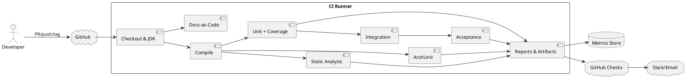

# RimWorldCraft — Drift Detection Pipeline

## 1. Введение

Архитектурный дрейф — постепенное расхождение реализации с утверждённой архитектурой. В RimWorldCraft он особенно опасен: один прямой import Minecraft API в Core, общий mutable singleton или обход aggregate boundary может привести к потере тестируемости, циклическим зависимостям, несовместимым save-файлам и трудно диагностируемым multiplayer-багам.

`drift-detection-pipeline.md` описывает автоматизированный pipeline, который обнаруживает такие нарушения до merge. Он дополняет:

- [`system-overview.md`](system-overview.md) — общие границы контейнеров;
- [`hexagonal-architecture.md`](hexagonal-architecture.md) — ports/adapters;
- [`archunit-rules.md`](archunit-rules.md) — executable architecture rules;
- [`testing-strategy.md`](testing-strategy.md) — test pyramid;
- [`codestyle-and-solidd.md`](codestyle-and-solidd.md) — style/SOLID;
- [`definition-of-done-do-d.md`](definition-of-done-do-d.md) — DoD.

### 1.1 Цели pipeline

- feedback по быстрым проверкам за несколько минут;
- блокировка merge при нарушении обязательного правила;
- повторяемая проверка на каждый PR;
- полные интеграционные/stress проверки на main, release и nightly;
- отчёты, артефакты и тренды качества;
- явная обработка legacy exceptions;
- Docs-as-Code контроль архитектурных изменений.

## 2. Общая архитектура pipeline



### 2.1 Типы проверок

| Проверка | Назначение | PR | Main | Nightly | Release |
|---|---|:---:|:---:|:---:|:---:|
| Compile | типовая корректность | ✓ | ✓ | ✓ | ✓ |
| Checkstyle/format | стиль | ✓ | ✓ | ✓ | ✓ |
| SpotBugs | потенциальные defects | ✓ | ✓ | ✓ | ✓ |
| ArchUnit | boundaries/dependencies | ✓ | ✓ | ✓ | ✓ |
| Unit + JaCoCo | behavior/coverage | ✓ | ✓ | ✓ | ✓ |
| Fast integration | adapters/contracts | затронутые | ✓ | ✓ | ✓ |
| Cucumber acceptance | user flows | selected | ✓ | ✓ | ✓ |
| Performance | latency/tick budget | selected | ✓ | ✓ | ✓ |
| Stress/stability | max load/long run | — | — | ✓ | selected |
| Save migrations | compatibility | — | selected | ✓ | ✓ |
| Docs-as-Code | docs drift | ✓ | ✓ | ✓ | ✓ |

## 3. Триггеры и расписание

### 3.1 Pull Request

Запускать при `opened`, `synchronize`, `reopened` и изменении review state:

- compile;
- Checkstyle/format;
- SpotBugs;
- ArchUnit;
- unit tests и coverage;
- changed-module contract/integration tests;
- JSON/schema validation;
- Docs-as-Code;
- короткий Cucumber smoke suite.

Изменение Core boundary, persistence, event contract или network protocol должно автоматически расширять test matrix через path-based selection либо требовать explicit label.

### 3.2 Push в `main`/`develop`

Полный fast+integration pipeline:

- все unit/contract tests;
- Forge/Fabric adapter tests;
- NBT/save migrations;
- acceptance suite;
- selected performance smoke;
- artifact/package verification.

### 3.3 Nightly

Например, cron `0 2 * * *` UTC:

- stress 1000 NPC;
- event flood/queue saturation;
- repeated save/load;
- полный migration matrix;
- Baritone/pathfinding world matrix;
- memory/thread leak checks;
- dependency/security scan;
- quality trend export.

### 3.4 Release candidate

Запускается на release branch/tag и требует ручного release review после зелёного CI:

- весь unit/integration/acceptance suite;
- Forge и Fabric matrix;
- save migration all supported versions;
- multiplayer smoke;
- performance baseline;
- packaging and checksum;
- manual QA sign-off.

## 4. Этапы pipeline

### Этап 1: Checkout и окружение

Использовать pinned JDK 17 или поддерживаемую более новую LTS-версию, если это отражено в project support matrix.

```yaml
- uses: actions/checkout@v4
- uses: actions/setup-java@v4
  with:
    distribution: temurin
    java-version: '17'
    cache: gradle
- uses: gradle/actions/setup-gradle@v4
```

Требования:

- Gradle wrapper version committed and verified;
- dependency cache не должен подменять lock/verification;
- environment versions отображаются в job summary;
- секреты не выводятся в logs.

### Этап 2: Компиляция

```bash
./gradlew compileJava compileTestJava --no-daemon --stacktrace
```

Проверяется:

- Core, Infrastructure, Client и test sources;
- Java 17 compatibility;
- warnings policy (`-Werror` для Core, если build поддерживает безопасную настройку);
- generated sources;
- отсутствие missing dependencies.

### Этап 3: Статический анализ

```bash
./gradlew checkstyleMain checkstyleTest spotbugsMain spotbugsTest
```

- Checkstyle/Spotless ловит format, naming/imports/Javadoc;
- SpotBugs ловит nullness, leaks, concurrency и suspicious code;
- SonarQube — optional quality gate;
- новые critical/high issues блокируют pipeline;
- suppressions требуют причины и scope.

### Этап 4: ArchUnit

```bash
./gradlew architectureTest
```

Запускаются правила из [`archunit-rules.md`](archunit-rules.md):

- Core не импортирует Minecraft/Forge/Fabric/Baritone;
- контексты не импортируют чужие domain internals;
- ports находятся в Core;
- adapters находятся в Infrastructure;
- repositories/factories/event hierarchy корректны;
- forbidden console/global state отсутствует;
- исключения не истекли.

Любое нарушение выводит rule ID, offending class/dependency и remediation hint.

### Этап 5: Unit tests и coverage

```bash
./gradlew test jacocoTestReport jacocoTestCoverageVerification
```

Пороги:

```text
Core >= 80% line + branch
Infrastructure >= 70% line + branch
Critical module thresholds follow module-specific DoD
```

Проверяются aggregates, value objects, factories, specifications, domain services, planners, event handlers и error paths.

### Этап 6: Integration tests

```bash
./gradlew integrationTest
```

Запускаются loader-specific harness/TestModLoader и adapters:

- Forge/Fabric registry/entity tests;
- NBT/save/load;
- network codecs and server authority;
- Baritone/pathfinding;
- JSON schema/config reload;
- event chains;
- repository contracts.

Тесты должны очищать test worlds, закрывать server/executors и сохранять logs при failure.

### Этап 7: Acceptance tests

```bash
./gradlew acceptanceTest
```

Cucumber-JVM + JUnit проверяет пользовательские сценарии:

```gherkin
Feature: Building system

  Scenario: NPC builds a wall
    Given a colony has 10 oak logs
    And an available citizen has building skill 50
    When the player places an oak wall blueprint
    Then a pending BuildOrder is created
    And the citizen is assigned to the task
    When the citizen completes the block
    Then the BuildOrder is completed
    And exactly one oak log is consumed
```

Step definitions вызывают application/test facade и не дублируют production business logic.

### Этап 8: Docs-as-Code

Проверяется соответствие изменённых paths обязательным документам:

| Изменённый path | Ожидаемый документ |
|---|---|
| `core/colony/**` | `module-colony.md`/`module-colony-manager.md`, architecture docs при boundary change |
| `core/npc/**` | `module-npc-core.md` |
| `core/story/**` | `module-storyteller.md` |
| `core/goal/**` | `module-goal-ai.md` |
| `core/building/**` | `module-building-system.md` |
| `core/events/**` или `*.event.*` | `event-system-api.md` |
| `core/*/repository/**` | `data-interfaces.md` |
| `infrastructure/save/**` | `save-serialization.md` |
| `infrastructure/entity/**` | `entity-integration.md` |
| `infrastructure/pathfinding/**` | `pathfinding-layer.md` |
| `config/rwc/**` | `data-dictionaries.md` и module config section |
| architecture rules | `archunit-rules.md` |

Пример lightweight shell check (только inspection в CI):

```bash
changed=$(git diff --name-only "${BASE_SHA}" "${HEAD_SHA}")

if echo "$changed" | grep -Eq '^src/main/java/.*/core/colony/'; then
  echo "$changed" | grep -Eq '(^|/)(module-colony(-manager)?|bounded-contexts|hexagonal-architecture)\.md$' \
    || { echo "Colony code changed without related documentation"; exit 1; }
fi
```

Для сложных rules предпочтителен `doc-detector`/Java or Gradle task, который учитывает PR labels и explicit `docs-not-needed` justification. Документация не должна обновляться механически ради галочки: reviewer проверяет semantic relevance.

Javadoc проверяется Checkstyle/Javadoc tool; ArchUnit не пытается читать source comments.

### Этап 9: Reports и metrics

Собираются:

- JUnit XML;
- JaCoCo HTML/XML;
- ArchUnit text/XML;
- Checkstyle/SpotBugs/Sonar reports;
- Cucumber HTML/JSON;
- performance CSV/JSON;
- migration matrix;
- logs/thread dumps при failure.

GitHub Checks summary содержит короткий результат, ссылки на artifacts и remediation.

### Этап 10: Artifacts

Artifacts сохраняются минимум для failed runs и release/nightly runs:

```text
reports/tests/**
reports/jacoco/**
reports/archunit/**
reports/checkstyle/**
reports/spotbugs/**
reports/cucumber/**
reports/performance/**
logs/**
mod-artifacts/**
```

Retention policy не должна сохранять секреты или полные пользовательские save files без sanitization.

## 5. Инструменты и технологии

| Область | Инструменты |
|---|---|
| CI | GitHub Actions или Jenkins |
| Build | Gradle Wrapper |
| Architecture | ArchUnit + JUnit 5 |
| Unit | JUnit 5, Mockito, AssertJ согласно build setup |
| Acceptance | Cucumber-JVM + JUnit Platform |
| Static | Checkstyle/Spotless, SpotBugs, optional SonarQube |
| Coverage | JaCoCo |
| Performance | JMH, VisualVM, YourKit |
| Config | JSON Schema validator, parser tests |
| Runtime integration | TestModLoader, Forge/Fabric harness |
| Notifications | GitHub Checks, Slack/email integration |

Все версии pin’ятся в Gradle и обновляются отдельной dependency task.

## 6. Пример GitHub Actions workflow

Файл: `.github/workflows/ci.yml`.

```yaml
name: RimWorldCraft CI

on:
  pull_request:
    types: [opened, synchronize, reopened, ready_for_review]
  push:
    branches: [main, develop]
  schedule:
    - cron: '0 2 * * *'
  workflow_dispatch:

permissions:
  contents: read
  checks: write
  pull-requests: read

concurrency:
  group: rwc-${{ github.workflow }}-${{ github.ref }}
  cancel-in-progress: true

env:
  JAVA_VERSION: '17'
  GRADLE_OPTS: -Dorg.gradle.daemon=false -Dorg.gradle.jvmargs=-Xmx3g

jobs:
  fast-checks:
    name: Fast checks
    runs-on: ubuntu-latest
    if: github.event_name != 'schedule'
    steps:
      - name: Checkout
        uses: actions/checkout@v4

      - name: Set up Java
        uses: actions/setup-java@v4
        with:
          distribution: temurin
          java-version: ${{ env.JAVA_VERSION }}
          cache: gradle

      - name: Set up Gradle
        uses: gradle/actions/setup-gradle@v4

      - name: Compile
        run: ./gradlew compileJava compileTestJava --no-daemon

      - name: Static analysis
        run: ./gradlew checkstyleMain checkstyleTest spotbugsMain --no-daemon

      - name: Architecture rules
        run: ./gradlew architectureTest --no-daemon

      - name: Unit tests and coverage
        run: ./gradlew test jacocoTestReport jacocoTestCoverageVerification --no-daemon

      - name: Config validation
        run: ./gradlew configTest --no-daemon

      - name: Documentation drift check
        env:
          BASE_SHA: ${{ github.event.pull_request.base.sha || github.event.before }}
          HEAD_SHA: ${{ github.sha }}
        run: ./gradlew docsCheck --no-daemon

      - name: Upload fast reports
        if: always()
        uses: actions/upload-artifact@v4
        with:
          name: fast-reports-${{ github.run_id }}
          if-no-files-found: warn
          path: |
            build/reports/**
            build/test-results/**

  integration:
    name: Integration and acceptance
    needs: fast-checks
    if: github.event_name == 'push' || github.event_name == 'workflow_dispatch'
    strategy:
      fail-fast: false
      matrix:
        loader: [forge, fabric]
    runs-on: ubuntu-latest
    steps:
      - uses: actions/checkout@v4
      - uses: actions/setup-java@v4
        with:
          distribution: temurin
          java-version: ${{ env.JAVA_VERSION }}
          cache: gradle
      - uses: gradle/actions/setup-gradle@v4

      - name: Integration tests
        run: ./gradlew integrationTest -Ploader=${{ matrix.loader }} --no-daemon

      - name: Acceptance tests
        run: ./gradlew acceptanceTest -Ploader=${{ matrix.loader }} --no-daemon

      - name: Upload integration reports
        if: always()
        uses: actions/upload-artifact@v4
        with:
          name: integration-${{ matrix.loader }}-${{ github.run_id }}
          if-no-files-found: warn
          path: |
            build/reports/**
            build/test-results/**
            logs/**

  nightly:
    name: Nightly stress and migrations
    if: github.event_name == 'schedule' || github.event_name == 'workflow_dispatch'
    runs-on: ubuntu-latest
    steps:
      - uses: actions/checkout@v4
      - uses: actions/setup-java@v4
        with:
          distribution: temurin
          java-version: ${{ env.JAVA_VERSION }}
          cache: gradle
      - uses: gradle/actions/setup-gradle@v4

      - name: Full verification
        run: ./gradlew check integrationTest acceptanceTest migrationTest --no-daemon

      - name: Stress tests
        run: ./gradlew stressTest performanceTest --no-daemon

      - name: Upload nightly reports
        if: always()
        uses: actions/upload-artifact@v4
        with:
          name: nightly-${{ github.run_id }}
          retention-days: 14
          if-no-files-found: warn
          path: |
            build/reports/**
            build/test-results/**
            logs/**
            performance/**
```

### 6.1 Практические замечания к workflow

- Job names и Gradle task names должны совпадать с фактическим build setup.
- `integrationTest`, `acceptanceTest`, `stressTest`, `docsCheck` могут потребовать custom source sets/tasks.
- Если Forge/Fabric не собираются в одной matrix, использовать отдельные workflows.
- Не хранить tokens в YAML или logs.
- Для external notifications использовать защищённые repository/environment secrets; значения не читать и не печатать в pipeline.
- Required status checks настраиваются в branch protection.

## 7. Обработка ошибок и уведомления

### 7.1 Ошибка проверки

При failure pipeline:

1. GitHub Check становится failed.
2. Job summary указывает этап/rule/test.
3. Artifact upload выполняется через `if: always()`.
4. Автор получает ссылку на failed job через GitHub UI.
5. Slack/email уведомление отправляется только для main/nightly/release или согласно notification policy.
6. PR не может быть merged при failed required check.

### 7.2 Rerun

Rerun разрешён после исправления причины или для подтверждения transient infrastructure failure. Rerun не заменяет fix. Если failure повторяется, создаётся issue с logs/seed/environment.

### 7.3 Error output

Хорошее сообщение:

```text
ARCH-CORE-001 failed
Class: com.rimworldcraft.core.npc.domain.Citizen
Dependency: net.minecraft.core.BlockPos
Fix: use GridPosition in Core and map to BlockPos in infrastructure adapter.
```

## 8. Мониторинг и метрики

### 8.1 Обязательные метрики

- coverage по каждому Core context;
- количество ArchUnit violations — целевое значение `0`;
- число active exclusions и ближайшая expiry date;
- pipeline duration p50/p95;
- PR fast-check duration;
- successful build percentage;
- test failure/flaky rate;
- SpotBugs/Checkstyle/Sonar issue trend;
- integration failure rate per loader;
- migration compatibility pass rate;
- performance p95/p99;
- artifact size and dependency changes.

### 8.2 Визуализация

Метрики публикуются в GitHub summary, CI dashboard или time-series store. Минимум раз в sprint команда просматривает:

- coverage trend;
- рост pipeline time;
- recurring architectural violations;
- flaky tests;
- escaped defects.

ArchUnit violations не «сглаживаются» графиком: любое нарушение blocking rule должно быть исправлено или явно оформлено.

## 9. Docs-as-Code политика

### 9.1 Mapping изменений

Изменения Core public API, ports, events, repository contracts, JSON schemas, persistence и network protocol требуют документации. Для чистого refactor без semantic change PR может указать `docs-not-needed` с объяснением.

### 9.2 Проверка diff

`docsCheck` анализирует:

- changed source paths;
- changed config/schema paths;
- added/removed public classes/methods;
- event/port/repository signatures;
- modified ArchUnit rules;
- наличие соответствующих `.md` изменений или justification.

Проверка не требует обновлять документ при каждом private variable rename, но требует обновить source-of-truth при изменении contract.

### 9.3 Javadoc

Javadoc для public classes/methods проверяется Checkstyle/Javadoc task. Missing docs — failure для Core public API и warning/exception policy для generated/loader-specific API.

## 10. Ручные проверки и аудит

### 10.1 Release candidate

После зелёного pipeline нужны:

- ручной architecture review;
- QA clean-world и existing-save testing;
- Forge/Fabric smoke;
- multiplayer two-client scenario;
- проверка artifacts/checksums;
- review known limitations and exclusions.

### 10.2 Архитектурный аудит

Ежеквартально архитектор/техлид:

1. просматривает exclusions registry;
2. проверяет trends и escaped defects;
3. запускает полный ArchUnit suite;
4. сравнивает code structure с docs;
5. проверяет module boundaries и shared kernel;
6. удаляет obsolete rules/exceptions через ADR;
7. формирует backlog drift cleanup.

## 11. Flaky tests

### 11.1 Политика

Flaky test — тест, который при одинаковом input/environment иногда проходит, иногда падает. Он не считается pass только потому, что прошёл после retry.

- unit tests: automatic retry запрещён;
- infrastructure startup: bounded retry допустим;
- integration: максимум 1 diagnostic rerun, first failure сохраняется;
- flaky тест получает `@Tag("flaky")`, issue, owner и deadline;
- quarantine не снимает quality gate навсегда;
- nightly запускает quarantined tests отдельно.

### 11.2 Причины и исправления

Проверять:

- shared mutable state;
- real system time вместо test clock;
- random без seed;
- race/async completion;
- port/thread misuse;
- order dependency;
- leaked server/executor;
- unstable test world.

Предпочитать deterministic executor, fixed seed, fake clock и Awaitility вместо `Thread.sleep()`.

## 12. Локальный запуск

Перед PR разработчик запускает:

```bash
./gradlew check
./gradlew architectureTest
./gradlew jacocoTestCoverageVerification
./gradlew configTest
```

Для затронутых boundaries:

```bash
./gradlew integrationTest
./gradlew acceptanceTest
./gradlew migrationTest
./gradlew performanceTest
```

Пути и task names должны соответствовать реальному Gradle setup. Не использовать stale CI cache для обхода failed checks.

## 13. Интеграция с DoD

| DoD | Pipeline evidence |
|---|---|
| Compilation | compile job |
| Style | Checkstyle/Spotless |
| Unit tests | JUnit report |
| Coverage | JaCoCo gate |
| Integration | integration job |
| Acceptance | Cucumber report |
| ArchUnit | architecture job |
| Static analysis | SpotBugs/Sonar |
| Config correctness | config/schema task |
| Save compatibility | migration task |
| Documentation | docsCheck + review |
| Manual testing | PR evidence/release checklist |
| Code review | branch protection/review state |

## 14. Эволюция pipeline

### Краткосрочно

- стабилизировать fast PR checks;
- добавить missing ArchUnit rules;
- подключить Docs-as-Code path mapping;
- публиковать единый report bundle;
- добавить migration fixtures и config validation.

### Среднесрочно

- включить JMH baseline и regression thresholds;
- добавить multiplayer bot harness;
- внедрить mutation testing critical policies;
- построить trend dashboard;
- добавить dependency/license/security scanning, например Snyk или одобренный equivalent после отдельного выбора.

### Долгосрочно

- remote/build cache при сохранении reproducibility;
- faster parallel runners;
- property-based architecture/config tests;
- fault injection для events/save/network;
- automated visual regression;
- dynamic test selection по dependency graph;
- architecture fitness functions и generated module maps.

Любой новый внешний сервис сначала оценивается с учётом фактического Java 17/Forge/Fabric/Gradle стека и требований безопасности проекта.

## 15. Связи с другими документами

- [`archunit-rules.md`](archunit-rules.md) — полный каталог архитектурных правил.
- [`testing-strategy.md`](testing-strategy.md) — test pyramid, Cucumber, performance, migrations и multiplayer testing.
- [`codestyle-and-solidd.md`](codestyle-and-solidd.md) — style/SOLID и forbidden practices.
- [`definition-of-done-do-d.md`](definition-of-done-do-d.md) — DoD для PR и типов задач.
- [`system-overview.md`](system-overview.md) — контейнеры и dependency direction.
- [`hexagonal-architecture.md`](hexagonal-architecture.md) — Core/ports/adapters.
- [`ddd-tactical-patterns.md`](ddd-tactical-patterns.md) — aggregate/entity/value object rules.
- [`event-system-api.md`](event-system-api.md) — event contracts, idempotency и outbox.
- [`data-interfaces.md`](data-interfaces.md) — repositories/factories/specifications.
- [`save-serialization.md`](save-serialization.md) — NBT schemas/migrations.
- `configuration-mutation-testing.md` — mutation tests JSON configurations.
- `drift-detection-pipeline.md` — этот документ и operational pipeline.

## 16. Заключение

Pipeline — это executable safety net, а не замена инженерному мышлению. ArchUnit защищает границы, static analysis — качество кода, tests — behavior, Docs-as-Code — актуальность решений, а performance/stress suites — эксплуатационную устойчивость.

Надёжная политика RimWorldCraft проста: быстрый feedback на PR, полный validation на main/release, глубокий stress ночью, нулевые необъяснённые архитектурные нарушения и прозрачные временные исключения. Любое изменение архитектуры сначала отражается в решениях и документации, затем закрепляется executable rule и только после этого распространяется на кодовую базу.
