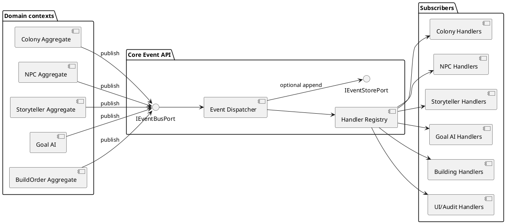

# RimWorldCraft — Event System API

## 1. Введение

Система событий RimWorldCraft обеспечивает слабосвязанное взаимодействие между bounded contexts: Colony, NPC, Storyteller, Goal AI и Building System. Агрегат сначала изменяет собственное состояние и формирует domain event, затем приложение публикует событие через `IEventBusPort`. Подписчики реагируют через собственные application services и не получают прямой доступ к чужим агрегатам.

Документ согласован с [`system-overview.md`](system-overview.md), [`bounded-contexts.md`](bounded-contexts.md) и [`hexagonal-architecture.md`](hexagonal-architecture.md). События расположены рядом с владельцами контекстов (`core.colony.event`, `core.npc.event` и т.д.), а инфраструктурный контракт шины находится в `core.ports.events`.

### 1.1 Ответственность

Система событий отвечает за:

- публикацию immutable domain/integration events;
- регистрацию и доставку handlers;
- изоляцию ошибок одного subscriber от остальных;
- ordering в пределах одного aggregate stream;
- idempotency и duplicate protection;
- optional event journal для аудита и восстановления;
- диагностику event chains.

Она **не** владеет бизнес-состоянием Colony/NPC/Storyteller и не заменяет repository, command API или transactional boundary агрегатов.

### 1.2 Domain Event и DDD

Domain Event — факт, который уже произошёл в домене: `NPCDeathEvent`, `BuildOrderCompletedEvent`, `ColonyValueChangedEvent`. Это не команда и не просьба. Подписчик может принять решение и вызвать свой use case, но не должен трактовать событие как приказ изменить чужой aggregate напрямую.

## 2. Основные концепции и термины

| Термин | Определение |
|---|---|
| **Domain Event** | Immutable факт изменения состояния домена с типом, временем, source и payload. |
| **Event Bus** | Компонент маршрутизации события зарегистрированным handlers. |
| **Publisher** | Aggregate/application service, создающий и публикующий событие. |
| **Subscriber** | Контекст/модуль, подписанный на тип события. |
| **Event Handler** | Код, обрабатывающий один event type и вызывающий собственный use case. |
| **Event Queue** | Очередь pending events при async delivery. |
| **Синхронная публикация** | `publish` вызывает handlers в текущем потоке и ждёт результата. |
| **Асинхронная публикация** | `publish` ставит событие в bounded executor/queue; обработка происходит позже. |
| **Event Sourcing** | Модель persistence, где состояние восстанавливается из полного журнала событий. В MVP не является обязательной. |
| **Idempotency** | Повторная доставка одного event не меняет результат второй раз. |
| **Eventually Consistent** | Subscriber может обновить собственную проекцию позже, после успешной публикации. |
| **Aggregate stream** | Лог событий одного aggregate, например `colony/<worldId>/<colonyId>`. |
| **Outbox** | Надёжно сохранённый набор событий, публикуемый после транзакции aggregate. |
| **Dead letter** | Событие, которое не удалось обработать после retry policy. |

## 3. Архитектура системы событий



### 3.1 Жизненный цикл события

```text
aggregate mutation
  -> domain event created
  -> event envelope validated
  -> repository/outbox commit
  -> IEventBusPort.publish
  -> handler selection
  -> handler idempotency check
  -> handler execution
  -> success / retry / dead-letter
  -> metrics and audit
```

### 3.2 Границы транзакции

Внутри одного aggregate event создаётся после изменения state. Шина не делает распределённую транзакцию между контекстами. Для критичных событий используется outbox или transactional event record. Subscriber сохраняет свою проекцию и processed marker отдельно.

## 4. Структура пакетов

```text
com.rimworldcraft.core.events/
  api/
    DomainEvent.java
    EventEnvelope.java
    EventHandler.java
    EventFilter.java
    Subscription.java
  bus/
    EventDispatcher.java
    HandlerRegistry.java
    DeliveryMode.java
    EventDeliveryPolicy.java
  handler/
    EventHandlerDescriptor.java
    HandlerErrorPolicy.java
  store/
    EventRecord.java
    EventStream.java
  exception/
    EventPublishException.java
    EventHandlerException.java
    EventStoreException.java
    DuplicateEventHandlerException.java
  serialization/
    EventCodec.java

com.rimworldcraft.core.ports.events/
  IEventBusPort.java
  IEventStorePort.java

com.rimworldcraft.core.colony.event/
com.rimworldcraft.core.npc.event/
com.rimworldcraft.core.story.event/
com.rimworldcraft.core.goal.event/
com.rimworldcraft.core.building.event/

com.rimworldcraft.infrastructure.events/
  InMemoryEventBus.java
  NbtEventStoreAdapter.java
  EventExecutorFactory.java
```

События не складываются все в `core.events`: owner context должен быть виден из package name. `core.events` содержит только общую механику и базовые contracts.

## 5. Базовый класс `DomainEvent`

### 5.1 Контракт

```java
public abstract class DomainEvent {
    private final UUID eventId;
    private final Instant timestamp;
    private final EventSource source;
    private final int version;

    protected DomainEvent(UUID eventId, Instant timestamp,
                          EventSource source, int version) {
        this.eventId = Objects.requireNonNull(eventId);
        this.timestamp = Objects.requireNonNull(timestamp);
        this.source = Objects.requireNonNull(source);
        if (version < 1) throw new IllegalArgumentException("version >= 1");
        this.version = version;
    }

    public UUID getEventId() { return eventId; }
    public Instant getTimestamp() { return timestamp; }
    public EventSource getSource() { return source; }
    public int getVersion() { return version; }
}

public record EventSource(
        String aggregateType,
        String aggregateId,
        WorldId worldId
) {}
```

`source` — не ссылка на объект aggregate, а стабильная идентичность: например, `("Citizen", citizenId, worldId)`. Для cross-context routing envelope дополнительно содержит `correlationId`, `causationId` и `schemaVersion`.

### 5.2 Рекомендуемый envelope

```java
public record EventEnvelope(
        UUID eventId,
        String eventType,
        int schemaVersion,
        Instant timestamp,
        EventSource source,
        String correlationId,
        String causationId,
        DomainEvent payload
) {}
```

Требования:

- `eventId` уникален;
- `timestamp` — UTC ISO-8601;
- `schemaVersion >= 1`;
- `eventType` стабилен и namespaced при внешнем контракте;
- payload immutable;
- `correlationId` сохраняется во всей цепочке;
- `causationId` указывает на непосредственное событие-причину, если оно есть.

## 6. Полный каталог событий

Ниже перечислены все обязательные события. События наследуются от `DomainEvent`; сокращённые конструкторы в примерах предполагают фабрику `EventMetadata`.

### 6.1 Colony events — `core.colony.event`

#### `ColonyCreatedEvent`

**Назначение:** новая колония успешно создана и сохранена.

```java
public final class ColonyCreatedEvent extends DomainEvent {
    private final ColonyId colonyId;
    private final String name;
    private final WorldId worldId;
    private final Map<ResourceType, Integer> initialResources;
}
```

- **Публикует:** `Colony`/`CreateColonyService`.
- **Подписчики:** NPC Core создаёт starter citizens; Building System инициализирует queue; Storyteller создаёт tracking state; Player/UI обновляет selection.
- **Условие:** persistence новой колонии завершилась успешно.

#### `ColonyValueChangedEvent`

```java
public final class ColonyValueChangedEvent extends DomainEvent {
    private final ColonyId colonyId;
    private final BigDecimal oldValue;
    private final BigDecimal newValue;
    private final String reason;
}
```

Публикует Colony value calculator. Storyteller обновляет threat scaling; UI показывает wealth; achievements могут проверять threshold. Не публиковать на каждый render tick — только при значимом изменении или configured batch.

#### `ResourceDepletedEvent`

```java
public final class ResourceDepletedEvent extends DomainEvent {
    private final ColonyId colonyId;
    private final ResourceType resource;
    private final String reservationOrOperationId;
}
```

Публикует Colony inventory ledger. Goal AI/Building освобождают или перепланируют tasks; Storyteller может использовать shortage как narrative input.

#### `ResourceUpdatedEvent`

```java
public final class ResourceUpdatedEvent extends DomainEvent {
    private final ColonyId colonyId;
    private final ResourceType resource;
    private final int oldAmount;
    private final int newAmount;
    private final String reason;
}
```

Публикует Colony. Storyteller, Building System, Goal AI projections и UI подписываются. Значения неотрицательны.

#### `CitizenJoinedEvent`

```java
public final class CitizenJoinedEvent extends DomainEvent {
    private final ColonyId colonyId;
    private final NpcId npcId;
    private final MembershipRole role;
}
```

Публикует Colony membership service. NPC/Goal AI получают доступную membership projection; Player/UI обновляют population list. Это counterpart NPC-side `NPCJoinedColonyEvent`; дублирование допускается только при явном owner/semantics.

#### `CitizenLeftEvent`

```java
public final class CitizenLeftEvent extends DomainEvent {
    private final ColonyId colonyId;
    private final NpcId npcId;
    private final CitizenLeaveReason reason;
}
```

Публикует Colony после удаления membership. Storyteller обновляет population/history; Goal AI отменяет tasks; UI удаляет citizen.

#### `ZoneAddedEvent` / `ZoneRemovedEvent`

```java
public final class ZoneAddedEvent extends DomainEvent {
    private final ColonyId colonyId;
    private final ZoneId zoneId;
    private final ZoneDefinition definition;
}

public final class ZoneRemovedEvent extends DomainEvent {
    private final ColonyId colonyId;
    private final ZoneId zoneId;
}
```

Building System и Goal AI обновляют task eligibility; NPC perception обновляет work zones. Zone definition должна быть immutable DTO с `WorldId`.

#### `ColonyDestroyedEvent`

```java
public final class ColonyDestroyedEvent extends DomainEvent {
    private final ColonyId colonyId;
    private final String reason;
    private final GameTick destroyedAt;
}
```

Подписчики: NPC/Goal AI suspend citizens; Storyteller завершает tracking; Building отменяет open orders; Player/UI показывает final state. Повторная доставка идемпотентна.

### 6.2 NPC events — `core.npc.event`

#### `NPCCreatedEvent`

```java
public final class NPCCreatedEvent extends DomainEvent {
    private final NpcId npcId;
    private final String displayName;
    private final NpcRole role;
    private final Optional<ColonyId> colonyId;
}
```

Публикует `CitizenFactory`/NPC application service. Colony добавляет membership через собственный command/event flow; Goal AI создаёт AI state; Storyteller обновляет population. Entity adapter создаёт Minecraft projection.

#### `NPCMoodChangedEvent`

```java
public final class NPCMoodChangedEvent extends DomainEvent {
    private final NpcId npcId;
    private final int oldMood;
    private final int newMood;
    private final String reason;
}
```

Публикует `Citizen`/`MoodCalculationService`. Storyteller пересчитывает pressure; Goal AI может trigger replan; Colony/UI обновляют projections. Значения `0..100`.

#### `NPCSkillIncreasedEvent`

```java
public final class NPCSkillIncreasedEvent extends DomainEvent {
    private final NpcId npcId;
    private final SkillType skillType;
    private final int oldLevel;
    private final int newLevel;
    private final SkillExperienceReason reason;
}
```

Публикует `SkillExperienceService`. Player achievements и Storyteller подписываются; Building/Goal AI могут обновить eligibility. Уровни `0..100`.

#### `NPCRelationshipChangedEvent`

```java
public final class NPCRelationshipChangedEvent extends DomainEvent {
    private final NpcId sourceNpcId;
    private final NpcId targetNpcId;
    private final int oldValue;
    private final int newValue;
    private final RelationshipReason reason;
}
```

Публикует `RelationshipService`; Storyteller использует конфликтные изменения; UI строит social projection. Self relationship запрещён.

#### `NPCNeedCriticalEvent`

```java
public final class NPCNeedCriticalEvent extends DomainEvent {
    private final NpcId npcId;
    private final NeedType needType;
    private final double currentValue;
    private final double criticalThreshold;
}
```

Публикует `NeedDecayService` при пересечении threshold с cooldown policy. Goal AI повышает survival goal; Storyteller учитывает distress; Colony/UI уведомляют. Не следует публиковать каждый tick при сохраняющемся critical state.

#### `NPCDeathEvent`

```java
public final class NPCDeathEvent extends DomainEvent {
    private final NpcId npcId;
    private final Optional<ColonyId> colonyId;
    private final DeathCause cause;
    private final GameTick deathTick;
}
```

Публикует `Citizen.die()`. Colony удаляет membership и публикует `CitizenLeftEvent`; Storyteller может создать mourning incident; Goal AI отменяет tasks; entity adapter despawns runtime entity.

#### `NPCJoinedColonyEvent` / `NPCLeftColonyEvent`

```java
public final class NPCJoinedColonyEvent extends DomainEvent {
    private final NpcId npcId;
    private final ColonyId colonyId;
    private final MembershipRole role;
}

public final class NPCLeftColonyEvent extends DomainEvent {
    private final NpcId npcId;
    private final ColonyId colonyId;
    private final String reason;
}
```

Публикует NPC membership flow. Colony synchronizes membership, Goal AI updates available tasks, Storyteller updates population. Чтобы не создать loop между `NPCJoinedColonyEvent` и `CitizenJoinedEvent`, envelope содержит causation/correlation and handlers use idempotency.

### 6.3 Storyteller events — `core.story.event`

#### `IncidentStartedEvent`

```java
public final class IncidentStartedEvent extends DomainEvent {
    private final IncidentId incidentId;
    private final ColonyId colonyId;
    private final IncidentType type;
    private final String description;
    private final int severity;
    private final GameTick startTime;
}
```

Публикует `Storyteller`/`IncidentFactory`. Colony applies relevant impact; NPC/Goal AI change behavior; entity adapter materializes spawn; UI shows notification.

#### `IncidentResolvedEvent`

```java
public final class IncidentResolvedEvent extends DomainEvent {
    private final IncidentId incidentId;
    private final ColonyId colonyId;
    private final IncidentOutcome outcome;
    private final Map<ResourceType, Integer> rewards;
    private final Map<String, Integer> effects;
}
```

Публикует `Incident.resolve()`. Colony applies rewards/penalties through its own use case; Storyteller writes history; Player/UI and achievements update.

#### `IncidentFailedEvent`

```java
public final class IncidentFailedEvent extends DomainEvent {
    private final IncidentId incidentId;
    private final ColonyId colonyId;
    private final String reason;
    private final Map<String, Integer> consequences;
}
```

Публикует `Incident.fail()`. Colony/NPC apply consequences via owned commands; Storyteller records failure; Goal AI may replan combat/survival.

#### `StoryArcStartedEvent`

```java
public final class StoryArcStartedEvent extends DomainEvent {
    private final StoryArcId arcId;
    private final ColonyId colonyId;
    private final String name;
    private final String description;
}
```

Публикует `StoryArcProgressionService`. UI/History подписываются; Colony/NPC получают только relevant effects; Storyteller owns progression.

#### `StoryArcProgressedEvent`

```java
public final class StoryArcProgressedEvent extends DomainEvent {
    private final StoryArcId arcId;
    private final ColonyId colonyId;
    private final int step;
    private final String newDescription;
}
```

Публикует Storyteller. UI/history and next-step projections subscribe. Новый incident создаётся Storyteller application flow, не handler’ом через прямой aggregate mutation.

#### `StoryArcCompletedEvent`

```java
public final class StoryArcCompletedEvent extends DomainEvent {
    private final StoryArcId arcId;
    private final ColonyId colonyId;
    private final IncidentOutcome finalOutcome;
    private final Map<ResourceType, Integer> rewards;
}
```

Colony применяет reward command; Player achievements реагируют; History logger сохраняет итог.

#### `StorytellerTickedEvent`

```java
public final class StorytellerTickedEvent extends DomainEvent {
    private final ColonyId colonyId;
    private final GameTick tick;
    private final long tickCount;
    private final int activeIncidentCount;
}
```

Служебное событие для diagnostics/metrics и optional debug UI. Не использовать как бизнес-триггер и не сохранять в persistent store при каждом tick по умолчанию.

### 6.4 Goal AI events — `core.goal.event`

#### `GoalChangedEvent`

```java
public final class GoalChangedEvent extends DomainEvent {
    private final CitizenId citizenId;
    private final Optional<GoalType> oldGoal;
    private final GoalType newGoal;
    private final String reason;
}
```

Публикует `CitizenAI`/`PriorityEvaluator`. NPC Core может обновить current task context; Storyteller использует массовые fight/flee facts; UI показывает status.

#### `PlanCreatedEvent`

```java
public final class PlanCreatedEvent extends DomainEvent {
    private final CitizenId citizenId;
    private final UUID planId;
    private final GoalType goal;
    private final List<ActionSummary> actions;
    private final int totalCost;
}
```

Публикует planner/application service. Diagnostics/UI подписываются; Storyteller может использовать recurring plan failures, но не должен зависеть от каждого plan event.

#### `ActionStartedEvent`

```java
public final class ActionStartedEvent extends DomainEvent {
    private final CitizenId citizenId;
    private final UUID executionId;
    private final ActionType actionType;
    private final Optional<GridPosition> target;
}
```

Публикует `ActionExecutor`. Building updates progress intent; NPC Core tracks work; Storyteller может учитывать combat actions; audit/UI подписываются.

#### `ActionCompletedEvent`

```java
public final class ActionCompletedEvent extends DomainEvent {
    private final CitizenId citizenId;
    private final UUID executionId;
    private final ActionType actionType;
    private final boolean success;
    private final String resultCode;
}
```

NPC Core начисляет XP через свой use case; Building updates task progress; Goal AI advances queue; Storyteller может читать aggregate facts.

#### `PlanFailedEvent`

```java
public final class PlanFailedEvent extends DomainEvent {
    private final CitizenId citizenId;
    private final UUID planId;
    private final GoalType goal;
    private final String reason;
}
```

Task/Building получают shortage/failure projection; UI уведомляет; Goal AI invokes fallback/replan; Storyteller может использовать systemic failure signals.

#### `TaskAssignedEvent`

```java
public final class TaskAssignedEvent extends DomainEvent {
    private final CitizenId citizenId;
    private final TaskId taskId;
    private final String taskType;
    private final TaskSource source;
}
```

Публикует `TaskManager`. NPC Core обновляет task context; Building tracks assigned order; UI shows assignment.

#### `TaskCompletedEvent`

```java
public final class TaskCompletedEvent extends DomainEvent {
    private final CitizenId citizenId;
    private final TaskId taskId;
    private final TaskResult result;
}
```

Building updates order; NPC Core awards skill XP; Colony applies resource/result command; UI and Storyteller may subscribe.

### 6.5 Building System events — `core.building.event`

#### `BuildOrderCreatedEvent`

```java
public final class BuildOrderCreatedEvent extends DomainEvent {
    private final BuildOrderId orderId;
    private final ColonyId colonyId;
    private final BlueprintId blueprintId;
    private final Map<ResourceType, Integer> resourcesRequired;
}
```

Публикует `BuildOrder`/creation service. Goal AI creates available task; Colony updates reservation projection; UI shows order; Storyteller may track construction.

#### `BuildOrderAssignedEvent`

```java
public final class BuildOrderAssignedEvent extends DomainEvent {
    private final BuildOrderId orderId;
    private final ColonyId colonyId;
    private final CitizenId citizenId;
}
```

Публикует `TaskScheduler`/`BuildOrder.assignCitizen()`. Goal AI принимает BUILD task; NPC Core получает skill/task context; UI updates worker list.

#### `BuildOrderProgressedEvent`

```java
public final class BuildOrderProgressedEvent extends DomainEvent {
    private final BuildOrderId orderId;
    private final int oldProgress;
    private final int newProgress;
    private final String progressReason;
}
```

Публикует `ProgressTracker`. UI/Building projections, Goal AI and NPC skill flow subscribe. Progress must be monotonic except explicit repair/rework policy.

#### `BuildOrderCompletedEvent`

```java
public final class BuildOrderCompletedEvent extends DomainEvent {
    private final BuildOrderId orderId;
    private final ColonyId colonyId;
    private final long durationTicks;
    private final List<CitizenId> contributors;
}
```

Colony updates value/resources; NPC Core awards construction XP; Storyteller may create “new building” narrative; Goal AI completes task.

#### `BuildOrderFailedEvent`

```java
public final class BuildOrderFailedEvent extends DomainEvent {
    private final BuildOrderId orderId;
    private final ColonyId colonyId;
    private final String reason;
    private final Map<ResourceType, Integer> releasedReservations;
}
```

Goal AI replans; Colony releases resources; UI notifies; Storyteller may observe repeated shortages.

#### `BuildOrderCancelledEvent`

```java
public final class BuildOrderCancelledEvent extends DomainEvent {
    private final BuildOrderId orderId;
    private final ColonyId colonyId;
    private final String reason;
    private final boolean ghostBlocksRemoved;
}
```

Colony releases reservations; Goal AI removes task; ghost adapter removes markers; UI updates queue.

#### `ResourcesReservedEvent`

```java
public final class ResourcesReservedEvent extends DomainEvent {
    private final BuildOrderId orderId;
    private final ColonyId colonyId;
    private final Map<ResourceType, Integer> resources;
    private final UUID reservationId;
}
```

Colony inventory owns reservation; Building records it; Goal AI uses availability projection. Reservation must be idempotent by `reservationId`.

#### `GhostBlockPlacedEvent`

```java
public final class GhostBlockPlacedEvent extends DomainEvent {
    private final BuildOrderId orderId;
    private final ColonyId colonyId;
    private final GridPosition position;
    private final String blockType;
    private final Rotation rotation;
}
```

Building/World projections, UI and Goal AI subscribe. Entity/block adapter materializes ghost marker; Core event contains no Minecraft `BlockState`.

## 7. Canonical JVM implementation

The active JVM skeleton uses `com.rimworldcraft.core.events.EventEnvelope`, `EventHandler`, `Subscription`, `EventDeliveryPolicy`, `DeadLetter`, and `com.rimworldcraft.core.ports.driven.EventBusPort`. `InMemoryEventBus` is the single in-process implementation. It delivers synchronously, requires explicit handler IDs, supports closeable subscriptions, bounded retries, dead letters, processed-event idempotency, aggregate-stream sequence ordering, and rejection of unknown schema versions. Typed mandatory payload contracts are grouped in `TypedEventContracts` for ColonyFounded, WorkAssigned, JobCompleted, NpcDied, and RaidGenerated.

Handlers receive envelopes and may call their own context's application port only; they must not import or mutate foreign aggregates. Async queues, durable outbox/event store, and Minecraft adapters remain Planned.

## 7. Порт `IEventBusPort` и реализация

### 7.1 Порт

```java
public interface IEventBusPort {
    void publish(DomainEvent event) throws EventPublishException;

    <E extends DomainEvent> Subscription subscribe(
            Class<E> eventType,
            EventHandler<E> handler);

    <E extends DomainEvent> void unsubscribe(
            Class<E> eventType,
            EventHandler<E> handler);
}
```

В production предпочтительно принимать `EventEnvelope`, чтобы routing metadata не терялась; overload с `DomainEvent` может создавать envelope в application layer.

### 7.2 Handler

```java
@FunctionalInterface
public interface EventHandler<E extends DomainEvent> {
    void handle(E event) throws EventHandlerException;
}

public interface Subscription extends AutoCloseable {
    @Override void close();
}
```

### 7.3 `InMemoryEventBus`

```java
public final class InMemoryEventBus implements IEventBusPort {
    private final ConcurrentMap<Class<?>, CopyOnWriteArrayList<EventHandler<?>>> handlers;
    private final EventDeliveryPolicy policy;
    private final ExecutorService executor;
    private final Optional<IEventStorePort> store;

    @Override
    public void publish(DomainEvent event) {
        validate(event);
        store.ifPresent(s -> s.save(event));
        List<EventHandler<?>> subscribers = handlers.getOrDefault(
                event.getClass(), new CopyOnWriteArrayList<>());
        if (policy.async()) {
            executor.submit(() -> dispatch(event, subscribers));
        } else {
            dispatch(event, subscribers);
        }
    }

    private void dispatch(DomainEvent event, List<EventHandler<?>> subscribers) {
        for (EventHandler<?> raw : subscribers) {
            try {
                invoke(raw, event);
            } catch (Exception failure) {
                policy.onHandlerFailure(event, failure);
            }
        }
    }
}
```

Основные свойства:

- `ConcurrentHashMap`/`CopyOnWriteArrayList` безопасны для регистрации;
- snapshot subscribers берётся на момент dispatch;
- exception handler не останавливает остальных subscribers;
- duplicate handler registration либо отклоняется, либо deduplicates по handler ID;
- bounded queue не позволяет неограниченно накапливать события;
- graceful shutdown дожидается permitted tasks и затем закрывает executor.

### 7.4 Sync и async delivery

**Синхронный режим** рекомендуется для доменных реакций, где текущая операция должна знать результат handler и нужен строгий ordering. Недостаток — handler блокирует server tick.

**Асинхронный режим** допустим для audit, UI projections и тяжёлых read-model updates. Нельзя в async handler напрямую мутировать Minecraft world без возвращения операции на server thread. Для одного aggregate нужен ordering key или single-thread lane.

Рекомендуемая конфигурация:

```text
pool: fixed bounded executor
threadPoolSize: 2–4 (server dependent)
queueCapacity: 1000
rejection: backpressure/dead-letter, never unbounded growth
uncaught handler exception: log + metrics + retry policy
```

## 8. Регистрация обработчиков

### 8.1 Явная регистрация

Предпочтительный способ — explicit registration в module bootstrap:

```java
public final class EventModuleBootstrap {
    public void register(IEventBusPort bus, ColonyHandlers colony,
                         StorytellerHandlers story) {
        bus.subscribe(NPCDeathEvent.class, colony::onNpcDeath);
        bus.subscribe(CitizenLeftEvent.class, story::onCitizenLeft);
        bus.subscribe(BuildOrderCompletedEvent.class, story::onBuildCompleted);
    }
}
```

Преимущества: видимый dependency graph, compile-time types, отсутствие неожиданной reflection.

### 8.2 `@EventHandler`

Reflection registration допустима для большого числа handlers:

```java
@Retention(RetentionPolicy.RUNTIME)
@Target(ElementType.METHOD)
public @interface EventHandler {
    Class<? extends DomainEvent> value();
    String id();
}
```

Bootstrap сканирует только известные packages, проверяет сигнатуру `void handle(E)`, уникальность `id` и регистрирует handler. Reflection не должна сканировать весь classpath на server startup без whitelist.

### 8.3 Жизненный цикл

- register после инициализации Core services;
- subscriptions сохраняются как `Subscription` handles;
- при world unload закрываются world-scoped subscriptions;
- при mod shutdown executor останавливается после drain policy;
- повторный bootstrap не регистрирует duplicate handlers.

## 9. Event Store

### 9.1 Контракт

```java
public interface IEventStorePort {
    void save(DomainEvent event) throws EventStoreException;
    List<DomainEvent> findBySource(String sourceId);
    List<DomainEvent> findByType(Class<? extends DomainEvent> eventType);
    List<DomainEvent> findStream(String aggregateType, String aggregateId);
}
```

### 9.2 Scope использования

MVP может использовать event store только для:

- audit/replay диагностики;
- истории колонии;
- расследования цепочек событий;
- проверки integration tests.

Полный Event Sourcing не включается автоматически: для него потребуются deterministic rehydration, snapshots, schema migrations и строгий ordering. Runtime aggregate repositories остаются источником состояния, если проект не принял отдельный ADR.

### 9.3 Реализации

- `InMemoryEventStore` — unit/integration tests;
- `NbtEventStoreAdapter` через `ISaveLoadPort` — optional persistent audit;
- `RollingEventStore` — bounded retention;
- future database/event log adapter — без изменений Core port.

`IEventStorePort.save` должен быть append-only в рамках stream. Служебные `StorytellerTickedEvent` и high-frequency events фильтруются или агрегируются.

## 10. Use cases и event chains

### 10.1 Создание колонии

```text
Player -> Colony CreateColonyUseCase
UseCase -> ColonyRepository: save
UseCase -> IEventBusPort: ColonyCreatedEvent
IEventBus -> NPC handler: create starter NPCs
IEventBus -> Building handler: create empty queue
IEventBus -> Storyteller handler: initialize storyteller
IEventBus -> UI handler: show colony
```

Subscribers не создают Colony повторно и не вызывают друг друга напрямую. NPC handler может опубликовать `NPCCreatedEvent` и `NPCJoinedColonyEvent` с `causationId = ColonyCreatedEvent.eventId`.

### 10.2 Смерть NPC и каскад

```text
Citizen.die()
  -> NPCDeathEvent
  -> Colony handler removes NpcId
  -> CitizenLeftEvent
  -> Storyteller increases mourning trigger
  -> Goal AI cancels tasks/replans remaining citizens
  -> UI notification
```

Каждый handler idempotent. `CitizenLeftEvent` не должен снова вызвать `NPCDeathEvent`; событие удаления membership — отдельный факт.

### 10.3 Завершение строительства

```text
BuildOrder.complete()
  -> BuildOrderCompletedEvent
  -> Colony applies value/resource outcome
  -> NPC Core awards skill XP to contributors
  -> Goal AI completes build task
  -> Storyteller records new-building fact
  -> UI updates projection
```

Если один subscriber упал, остальные получают событие согласно delivery policy. Failed handler получает retry/dead-letter record.

### 10.4 Ошибка подписчика

```text
publish(event)
  -> handler A success
  -> handler B throws SaveLoadException
  -> log error + metrics
  -> retry B if policy allows
  -> handler C still executes
```

Нельзя silently swallow failure: event ID, handler ID, correlation ID и error code обязательны в diagnostics.

## 11. Конфигурация `event-settings.json`

Источник: `config/rwc/events/event-settings.json`.

```json
{
  "$schema": "rwc://schemas/events/event-settings.schema.json",
  "version": 1,
  "deliveryMode": "SYNCHRONOUS",
  "asyncProcessing": false,
  "threadPoolSize": 2,
  "queueCapacity": 1000,
  "logEvents": true,
  "eventStoreEnabled": false,
  "eventStoreMaxEntries": 10000,
  "maxHandlerRetries": 3,
  "retryBackoffTicks": 20,
  "preserveAggregateOrdering": true,
  "debugEventTypes": ["PlanFailedEvent", "NPCDeathEvent"],
  "ignoredEventTypes": ["StorytellerTickedEvent"]
}
```

### 11.1 Правила

- `deliveryMode` ∈ `SYNCHRONOUS`, `ASYNCHRONOUS`;
- `threadPoolSize` `1..32`;
- `queueCapacity` `1..100000`;
- `maxHandlerRetries` `0..10`;
- `eventStoreMaxEntries >= 0`;
- `debugEventTypes` и `ignoredEventTypes` содержат известные event type names или namespaced extensions;
- нельзя одновременно игнорировать critical event без explicit warning;
- async mode требует bounded queue;
- ordering policy нельзя отключать для aggregate streams без ADR.

### 11.2 Загрузка

`EventSettingsJsonParser` → schema validation → semantic validation → immutable `EventDeliveryPolicy` → composition root. Handler registration не читает JSON напрямую.

## 12. Порты системы событий

### `IEventBusPort`

- `publish` используется aggregate/application после commit;
- `subscribe` вызывается module bootstrap;
- `unsubscribe` вызывается при world/module unload;
- адаптер отвечает за sync/async delivery, retry и handler isolation.

### `ISaveLoadPort`

Используется `NbtEventStoreAdapter`:

```java
Optional<SaveDocument> load(SaveKey key);
void save(SaveKey key, SaveDocument document);
```

Event store не должен напрямую импортировать NBT в Core.

### `ITimePort`

Используется для timestamp/tick metadata, retry backoff и retention:

```java
GameTick currentTick(WorldId worldId);
Instant now();
```

Если `DomainEvent.timestamp` создаёт application layer, он получает время через `ITimePort`, а не системные часы.

### Дополнительные порты

- `ILogPort` — normalized logging без `System.out`;
- `IMetricsPort` — delivery latency, failures, queue depth;
- `INetworkPort` — внешний adapter для client notifications, не часть доменного bus semantics.

## 13. Ошибки и восстановление

### 13.1 Исключения

```java
public final class EventPublishException extends RuntimeException {
    public EventPublishException(String message, Throwable cause) {
        super(message, cause);
    }
}

public final class EventHandlerException extends RuntimeException {
    private final String handlerId;
    public EventHandlerException(String handlerId, Throwable cause) {
        super("Handler failed: " + handlerId, cause);
        this.handlerId = handlerId;
    }
}

public final class EventStoreException extends RuntimeException {
    public EventStoreException(String message, Throwable cause) {
        super(message, cause);
    }
}

public final class DuplicateEventHandlerException extends RuntimeException {
    public DuplicateEventHandlerException(String handlerId) {
        super("Duplicate event handler: " + handlerId);
    }
}
```

### 13.2 Delivery policy

| Ошибка | Действие |
|---|---|
| invalid event metadata | отклонить до dispatch, log validation error |
| queue full | backpressure, retry at caller или dead letter; не расширять queue бесконечно |
| handler exception | log, metrics, остальные handlers продолжают |
| transient handler failure | bounded retry с backoff |
| permanent schema failure | dead letter и operator diagnostic |
| event store failure | strict mode: publish fails; best-effort mode: log/metric, policy from config |
| duplicate event ID | idempotent no-op или conflict diagnostic |
| duplicate handler | reject registration |

### 13.3 Exactly-once и best effort

В памяти шина гарантирует best-effort delivery, а не exactly-once. Exactly-once end-to-end требует durable outbox, deduplication и idempotent handlers. Документируемая MVP-гарантия:

- event может быть доставлен более одного раза;
- handler не должен применять его повторно;
- остальные handlers не блокируются из-за одного failure;
- ordering гарантируется только в пределах настроенного aggregate stream.

## 14. Тестирование

### 14.1 Unit-тесты шины

Обязательные cases:

- publish доставляет событие всем subscribers;
- unsubscribe прекращает доставку;
- handler exception не прерывает остальных;
- duplicate handler отклоняется;
- async queue obeys capacity;
- retry выполняется ограниченное число раз;
- event ID deduplication работает;
- ordering одного stream сохраняется;
- shutdown закрывает executor без утечки threads.

```java
@Test
void oneFailingHandlerDoesNotBlockOtherSubscribers() {
    RecordingHandler good = new RecordingHandler();
    bus.subscribe(NPCDeathEvent.class, event -> {
        throw new EventHandlerException("broken", null);
    });
    bus.subscribe(NPCDeathEvent.class, good);

    bus.publish(NpcEventFixtures.death());

    assertThat(good.events()).hasSize(1);
    assertThat(metrics.handlerFailures()).isEqualTo(1);
}
```

### 14.2 Unit-тесты handlers

Каждый handler тестируется с fake repositories/ports:

- `NPCDeathEvent` удаляет membership ровно один раз;
- `BuildOrderCompletedEvent` обновляет Colony value через owning use case;
- `NPCMoodChangedEvent` создаёт Storyteller pressure projection;
- `TaskCompletedEvent` не начисляет XP повторно;
- unknown schema version отправляется в dead letter.

### 14.3 Интеграционные цепочки

Минимальный набор:

1. `ColonyCreatedEvent` → starter NPC + queue + storyteller tracking.
2. `NPCDeathEvent` → `CitizenLeftEvent` → Colony membership removed.
3. `BuildOrderCompletedEvent` → value update + XP + storyteller history.
4. `ResourcesReservedEvent` → duplicate reservation rejected/no-op.
5. async mode сохраняет per-aggregate ordering.
6. NBT event store сохраняет и загружает event records.

### 14.4 Acceptance Gherkin

```gherkin
Feature: Event system

  Scenario: Colony reacts to NPC death
    Given a colony with citizen "alex"
    And the NPC event bus is running
    When the citizen dies from "RAID_DAMAGE"
    Then NPCDeathEvent is published
    And CitizenLeftEvent is published
    And the colony removes citizen "alex" from its membership
    And Storyteller receives CitizenLeftEvent
    And Goal AI cancels tasks assigned to "alex"

  Scenario: Subscriber failure does not stop delivery
    Given three subscribers for BuildOrderCompletedEvent
    And the second subscriber fails to save its projection
    When BuildOrderCompletedEvent is published
    Then the first subscriber completes
    And the third subscriber completes
    And the second failure is recorded with the eventId
```

### 14.5 Coverage

Target for event bus and handlers: `>=85%` line/branch coverage. Обязательно отдельно покрыть:

- retry/dead-letter branches;
- duplicate delivery;
- async queue saturation;
- ordering;
- schema/version rejection;
- shutdown and subscription lifecycle.

## 15. DoD Event System

- [ ] Все события имеют корректную иерархию наследования от `DomainEvent`.
- [ ] `IEventBusPort` реализован и протестирован в sync и, если включён, async режиме.
- [ ] Все доменные события задокументированы в этом документе и имеют Javadoc/contract schema.
- [ ] Реализованы subscribers для всех критических межконтекстных событий.
- [ ] Unit-тесты шины и handlers достигают не менее 85% покрытия.
- [ ] Интеграционные тесты покрывают критические event chains.
- [ ] `event-settings.json` корректно загружается и валидируется.
- [ ] ArchUnit-правила проходят в CI.
- [ ] Exception одного handler не нарушает доставку другим handlers.
- [ ] Retry, duplicate delivery, ordering и dead-letter policy задокументированы.
- [ ] Для critical events определён outbox/consistency policy.
- [ ] Нет утечек executor threads при unload/shutdown.

## 16. ArchUnit-правила

### 16.1 Core events не зависят от Minecraft

```java
noClasses()
    .that().resideInAnyPackage("com.rimworldcraft.core.events..")
    .should().dependOnClassesThat()
    .resideInAnyPackage(
        "net.minecraft..",
        "net.minecraftforge..",
        "net.fabricmc.."
    );
```

То же правило применяется к `core.*.event`.

### 16.2 Разрешённые зависимости

```java
noClasses()
    .that().resideInAnyPackage(
        "com.rimworldcraft.core.events..",
        "com.rimworldcraft.core.ports.events.."
    )
    .should().dependOnClassesThat()
    .resideInAnyPackage(
        "com.rimworldcraft.infrastructure..",
        "com.rimworldcraft.client.."
    );
```

### 16.3 Все события наследуются от `DomainEvent`

```java
classes()
    .that().resideInAnyPackage(
        "com.rimworldcraft.core.colony.event..",
        "com.rimworldcraft.core.npc.event..",
        "com.rimworldcraft.core.story.event..",
        "com.rimworldcraft.core.goal.event..",
        "com.rimworldcraft.core.building.event.."
    )
    .should().beAssignableTo(DomainEvent.class);
```

### 16.4 Порт — интерфейс, adapter — outside Core

```java
classes()
    .that().resideInAnyPackage("com.rimworldcraft.core.ports.events..")
    .should().beInterfaces();

noClasses()
    .that().resideInAnyPackage("com.rimworldcraft.core.events..")
    .should().dependOnClassesThat()
    .resideInAnyPackage("com.rimworldcraft.infrastructure.events..");
```

### 16.5 Запрет `System.out`

```java
noClasses()
    .that().resideInAnyPackage("com.rimworldcraft.core.events..")
    .should().accessClassesThat()
    .belongToAnyOf(System.class);
```

Production logging выполняется через logger/`ILogPort`.

### 16.6 Handler не зависит от чужих aggregate internals

```java
noClasses()
    .that().resideInAnyPackage("com.rimworldcraft.core.events.handler..")
    .should().dependOnClassesThat()
    .resideInAnyPackage(
        "com.rimworldcraft.core.colony.domain..",
        "com.rimworldcraft.core.npc.domain..",
        "com.rimworldcraft.core.story.domain..",
        "com.rimworldcraft.core.goal.domain..",
        "com.rimworldcraft.core.building.domain.."
    );
```

Handlers вызывают public application ports/use cases или projections.

## 17. Наблюдаемость и эксплуатация

Каждая доставка должна иметь:

- `eventId`, `eventType`, `source`, `handlerId`;
- `correlationId`, `causationId`;
- delivery mode, attempt number, duration;
- outcome: success/retry/dead-letter;
- queue depth и executor rejection count.

Рекомендуемые метрики:

```text
event_bus.published_total
event_bus.delivered_total
event_bus.handler_failures_total
event_bus.retry_total
event_bus.dead_letter_total
event_bus.queue_depth
event_bus.handler_duration_ms
```

`StorytellerTickedEvent` и другие high-frequency events должны иметь sampling/disable policy, иначе audit storage и log будут расти без ограничения.

## 18. Расширение и миграция

### 18.1 Новый event type

1. Определить owner context и семантику факта.
2. Создать immutable class в `core.<context>.event`.
3. Добавить metadata, schemaVersion и Javadoc.
4. Описать subscribers и idempotency behavior.
5. Добавить schema/serialization fixture.
6. Добавить unit и integration tests.
7. Зарегистрировать handler в module bootstrap.
8. Обновить `bounded-contexts.md`, module document и этот каталог.

### 18.2 Эволюция payload

- additive optional field — minor-compatible;
- изменение meaning — новый event type или major schema version;
- удаление поля — после compatibility window;
- handlers должны игнорировать неизвестные optional fields;
- old events мигрируются codec/migration layer, не aggregate handler’ом.

### 18.3 Внешняя очередь

`IEventBusPort` может получить adapter для Kafka/RabbitMQ/другого брокера без изменения Core. Потребуются:

- serialization codec;
- partition key = aggregate stream;
- consumer group per bounded context;
- durable offsets;
- retry topic/dead-letter topic;
- idempotency store;
- tracing metadata.

В multiplayer server MVP внешний брокер не нужен: `InMemoryEventBus` + optional NBT outbox проще и надёжнее в рамках одного Minecraft server process. Внешняя очередь оправдана при межсерверными процессами, аналитикой или отдельным event processing cluster.

## 19. Связи с другими документами

- [`bounded-contexts.md`](bounded-contexts.md) — владельцы контекстов, identifiers, event-based communication и запрет циклических зависимостей.
- [`hexagonal-architecture.md`](hexagonal-architecture.md) — `IEventBusPort`, adapters, DI и Core isolation.
- [`module-colony-manager.md`](module-colony-manager.md) — события Colony; в текущем наборе документов ближайший файл может называться `module-colony.md`.
- [`module-npc-core.md`](module-npc-core.md) — NPC events: mood, skills, needs, relationship, death и membership.
- [`module-storyteller.md`](module-storyteller.md) — Storyteller incidents, arcs и tick events.
- [`module-goal-ai.md`](module-goal-ai.md) — Goal/Plan/Action/Task events и replanning.
- [`module-building-system.md`](module-building-system.md) — build order, ghost blocks, resources and progress events.
- [`data-dictionaries.md`](data-dictionaries.md) — JSON conventions и event settings schema.
- `persistence.md` — NBT save, outbox и event store retention.
- `testing-strategy.md` — contract, integration и acceptance testing.
- `archunit-rules.md` — полный executable набор architectural constraints.

## 20. Compliance status

Implemented evidence is recorded in [`event-system-compliance-report.md`](event-system-compliance-report.md). The current MVP guarantees synchronous best-effort delivery, explicit registration/lifecycle, retry/dead-letter behavior, idempotency, per-stream ordering, and schema rejection. Full cross-context production handlers and durable persistence remain Pending.

## 21. Итоговая гарантия системы

Event System RimWorldCraft предоставляет best-effort, versioned и observable delivery domain facts. Он отделяет контексты, но не скрывает границы владения: NPC Core остаётся владельцем NPC state, Colony — membership/resources, Building — build orders, Storyteller — incidents, Goal AI — plans/tasks. Для надёжности каждый handler должен быть идемпотентным, каждое событие — иметь стабильную metadata, а каждая критичная цепочка — быть покрыта integration test.
