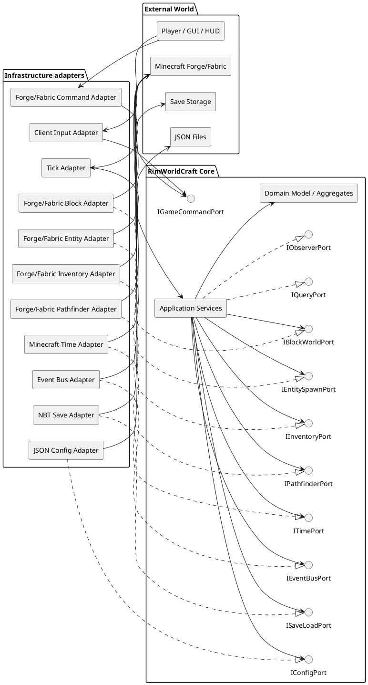

# RimWorldCraft — Hexagonal Architecture

## 1. Введение

Этот документ развивает [`system-overview.md`](system-overview.md) и [`bounded-contexts.md`](bounded-contexts.md). Он описывает практическую реализацию архитектуры Ports and Adapters для RimWorldCraft — Minecraft-мода на Java 17, объединяющего симуляцию колонии и action gameplay от первого лица.

Цель документа — дать разработчику однозначные ответы на вопросы:

- где размещать бизнес-правило;
- как Core получает данные о мире;
- как команда игрока попадает в use case;
- где преобразуются Minecraft objects;
- как заменить Forge адаптер Fabric-адаптером или NBT другим хранилищем;
- как тестировать Core без Minecraft runtime.

### Почему выбрана гексагональная архитектура

Minecraft API быстро меняется, отличается между Forge и Fabric и требует специфической thread/lifecycle модели. Если доменные правила будут смешаны с `Level`, `Entity`, `ItemStack`, packet handlers или NBT, система станет трудной для тестирования и миграции.

Гексагональная архитектура помещает Core в центр и делает зависимости направленными внутрь:

```text
внешний мир -> driving adapters -> driving ports -> Core
Core -> driven ports -> driven adapters -> внешний мир
```

Core содержит DDD-модель и use cases, но не знает, кто именно реализует порт. Это поддерживает SOLID, TDD, заменяемость инфраструктуры и обязательный контроль архитектурного дрейфа через ArchUnit.

## 2. Архитектурные принципы

1. **Core не импортирует Minecraft API.** Запрещены `net.minecraft.*`, `net.minecraftforge.*`, `net.fabricmc.*` и типы сторонних Minecraft-интеграций.
2. **Порты принадлежат Core.** Внешний слой реализует их, а не определяет бизнес-контракты.
3. **Адаптеры преобразуют модели.** Minecraft objects не протекают через границу Core.
4. **Сервер authoritative.** Все изменения состояния выполняются на сервере; клиент только отправляет команды и отображает projections.
5. **Агрегаты изменяются через use cases.** Адаптер не вызывает методы aggregate напрямую, минуя application layer.
6. **Порты узкие и предметные.** Порт должен выражать потребность Core, а не копировать API Minecraft.
7. **Зависимости внедряются через конструктор.** В Core нет service locator, static singleton или скрытого доступа к Minecraft.
8. **Время и случайность инъецируются.** Это делает simulation детерминированной и тестируемой.
9. **Ошибки переводятся на границе.** Minecraft exceptions не покидают infrastructure adapter.
10. **Каждое архитектурное исключение документируется ADR и ограничивается ArchUnit `ignoreDependency` только при необходимости.**

## 3. Общая схема портов и адаптеров



### Привязка портов к bounded contexts

| Порт | Тип | Основные контексты |
|---|---|---|
| `IGameCommandPort` | driving | Player, Colony, NPC, Storyteller |
| `IQueryPort` | driving | Colony, NPC, Player, Storyteller |
| `IObserverPort` | driving | все, через projections |
| `IBlockWorldPort` | driven | World, Colony, NPC, Storyteller |
| `IEntitySpawnPort` | driven | NPC, Storyteller, Combat в будущем |
| `IInventoryPort` | driven | Colony, Player, NPC job execution |
| `IPathfinderPort` | driven | NPC, World |
| `ISaveLoadPort` | driven | Colony, NPC, Storyteller, Player |
| `ITimePort` | driven | все simulation contexts |
| `IEventBusPort` | driven | все contexts |
| `IConfigPort` | driven | Colony, NPC, Storyteller, World, Player |

## 4. Модели данных на границе

Core использует собственные types. Они должны быть сериализуемыми и не содержать Minecraft references.

```java
public record GridPosition(int x, int y, int z, WorldId worldId) {}

public record WorldId(String value) {
    public WorldId {
        if (value == null || value.isBlank()) {
            throw new IllegalArgumentException("WorldId must not be blank");
        }
    }
}

public record NpcId(UUID value) {}
public record ColonyId(UUID value) {}
public record PlayerId(UUID value) {}
```

`GridPosition` заменяет `BlockPos`; `NpcId` заменяет ссылку на `Entity`; `ResourceStack` заменяет `ItemStack`; `SaveDocument` заменяет `CompoundTag` внутри Core.

### Command, query и event envelope

```java
public record CommandId(UUID value) {}

public interface CoreCommand {
    CommandId commandId();
    WorldId worldId();
    PlayerId actorId();
}

public record EventEnvelope(
        UUID eventId,
        String eventType,
        int schemaVersion,
        Instant occurredAt,
        WorldId worldId,
        String correlationId,
        Object payload
) {}
```

Публичные DTO должны быть immutable, валидироваться при создании и иметь явную версию схемы.

## 5. Driving ports — входящие порты

Driving port — это контракт, который Core предоставляет внешнему миру. Адаптер инициирует вызов: игрок, Minecraft tick, network packet, тестовый harness или CLI для диагностики.

### 5.1 `IGameCommandPort`

**Назначение:** обработка команд изменения состояния. Реализация обычно делегирует конкретным use case интерфейсам контекстов.

```java
public interface IGameCommandPort {
    CommandResult placeBuildOrder(PlaceBuildOrderCommand command);
    CommandResult assignTask(AssignTaskCommand command);
    CommandResult startRaid(StartRaidCommand command);
    CommandResult foundColony(FoundColonyCommand command);
    CommandResult handlePlayerAction(PlayerActionCommand command);
}
```

Команды содержат только Core data:

```java
public record AssignTaskCommand(
        CommandId commandId,
        WorldId worldId,
        PlayerId actorId,
        ColonyId colonyId,
        NpcId npcId,
        String jobTypeId,
        GridPosition target
) implements CoreCommand {}
```

**Контексты:** Player авторизует команду; Colony владеет `assignTask`; NPC принимает `WorkAssigned`; World проверяет target через driven port.

**Пример driving adapter:**

```java
public final class ForgeCommandAdapter {
    private final IGameCommandPort commands;

    public ForgeCommandAdapter(IGameCommandPort commands) {
        this.commands = commands;
    }

    public void onAssignTask(ServerPlayer player, ForgeTaskPacket packet) {
        PlayerId actor = new PlayerId(player.getUUID());
        AssignTaskCommand command = CommandMapper.toCore(actor, player.level(), packet);
        CommandResult result = commands.assignTask(command);
        ResultMapper.sendToPlayer(player, result);
    }
}
```

`ServerPlayer`, packet types и `level()` используются только в adapter.

### 5.2 `IQueryPort`

**Назначение:** read-only запросы для UI, HUD, commands и diagnostics. Query не мутирует агрегаты.

```java
public interface IQueryPort {
    ColonyView getColony(ColonyId colonyId, PlayerId viewer);
    List<NpcView> listColonists(ColonyId colonyId, PlayerId viewer);
    InventoryView getColonyResources(ColonyId colonyId, PlayerId viewer);
    StorytellerView getStoryteller(WorldId worldId, PlayerId viewer);
}
```

**Контексты:** реализуется application query layer конкретного контекста; authorization выполняется до выдачи данных.

**Пример вызова из GUI adapter:**

```java
public void refresh(ForgeScreen screen, ServerProxy proxy) {
    ColonyView view = proxy.queries()
            .getColony(screen.colonyId(), screen.viewerId());
    screen.render(view);
}
```

Клиент получает DTO или server projection, а не доменные aggregates.

### 5.3 `IObserverPort`

**Назначение:** подписка внешнего слоя на опубликованные Core events или готовые UI projections.

```java
public interface IObserverPort {
    Subscription observe(ObserverFilter filter, CoreObserver observer);
}

@FunctionalInterface
public interface CoreObserver {
    void onEvent(EventEnvelope event);
}

public interface Subscription extends AutoCloseable {
    @Override void close();
}
```

**Контексты:** infrastructure/client adapter подписывается на события Colony/NPC/Storyteller/World, после чего отправляет обновления HUD или notification.

**Пример:**

```java
Subscription subscription = observerPort.observe(
        ObserverFilter.forColony(colonyId),
        event -> network.sendColonyProjection(event)
);
```

Observer не должен давать клиенту возможность изменить Core напрямую. Для изменения используются commands.

### 5.4 Tick и lifecycle driving ports

Хотя базовый документ перечисляет три главных входящих порта, tick и lifecycle также должны иметь explicit contracts:

```java
public interface AdvanceSimulationPort {
    void advance(GameTick tick);
}

public interface LifecyclePort {
    void onWorldLoaded(WorldId worldId);
    void onWorldSaving(WorldId worldId);
    void onWorldUnloaded(WorldId worldId);
}
```

Forge/Fabric tick callbacks адаптируются к `GameTick`, а не передаются в Core как event objects Minecraft.

## 6. Driven ports — исходящие порты

Driven port — это потребность Core во внешней способности. Core определяет минимальный контракт, а infrastructure supplies implementation.

Во всех примерах используются Core types. Интерфейс может называться с префиксом `I` согласно требованиям проекта; в новых классах рекомендуется единый convention без избыточных префиксов. В данном документе сохраняются запрошенные имена.

## 7. `IBlockWorldPort`

### Назначение

Предоставляет абстрактный доступ к world facts и ограниченным изменениям блоков. Используется WorldContext для наблюдения, Colony для валидации участка и NPC для проверки целей/опасностей.

### Контракт

```java
/**
 * Core-facing view of the Minecraft world.
 * Must not expose Level, BlockState, Biome, LightTexture or BlockPos.
 */
public interface IBlockWorldPort {
    /** Returns immutable facts about a position. */
    BlockSnapshot inspect(GridPosition position) throws WorldAccessException;

    /** Checks whether a settlement may be created at the site. */
    SettlementValidation validateSettlement(SettlementSite site)
            throws WorldAccessException;

    /** Returns the light level known to the world adapter. */
    LightLevel lightAt(GridPosition position) throws WorldAccessException;

    /** Returns biome/climate facts normalized to Core types. */
    ClimateFact climateAt(GridPosition position) throws WorldAccessException;

    /** Applies a validated block operation; mutation is server-side only. */
    BlockMutationResult apply(BlockOperation operation)
            throws WorldMutationException;
}
```

Пример Core types:

```java
public record BlockSnapshot(
        GridPosition position,
        String blockTypeId,
        boolean solid,
        boolean replaceable,
        int lightLevel
) {}

public record ClimateFact(String climateId, double temperature, double humidity) {}
public record LightLevel(int value) {}
```

### Minecraft адаптер

- Forge: `ForgeBlockAdapter`
- Fabric: `FabricBlockAdapter`
- Общий контрактный mapper: `MinecraftBlockMapper`

Адаптер получает `ServerLevel` только в constructor/composition root или method boundary, проверяет thread, переводит `GridPosition` в `BlockPos`, вызывает API Minecraft и преобразует результат обратно.

### Тестирование

Unit-тесты используют:

```java
final class FakeBlockWorldPort implements IBlockWorldPort {
    private final Map<GridPosition, BlockSnapshot> blocks = new HashMap<>();

    @Override public BlockSnapshot inspect(GridPosition position) {
        return blocks.getOrDefault(position,
                new BlockSnapshot(position, "air", false, true, 15));
    }

    @Override public SettlementValidation validateSettlement(SettlementSite site) {
        return SettlementValidation.valid();
    }

    @Override public LightLevel lightAt(GridPosition position) { return new LightLevel(15); }
    @Override public ClimateFact climateAt(GridPosition position) {
        return new ClimateFact("temperate", 18.0, 0.5);
    }
    @Override public BlockMutationResult apply(BlockOperation operation) {
        return BlockMutationResult.accepted();
    }
}
```

Тестируется policy, а не Minecraft block behavior. Реальный adapter проверяется integration test с test world.

## 8. `IEntitySpawnPort`

### Назначение

Материализует доменные spawn intents в NPC, hostile mobs или item entities. Core формирует intent, но не создаёт entity самостоятельно.

### Контракт

```java
/** Creates and removes game entities through a platform adapter. */
public interface IEntitySpawnPort {
    SpawnResult spawn(SpawnIntent intent) throws EntitySpawnException;
    DespawnResult despawn(EntityId entityId) throws EntityAccessException;
    Optional<EntitySnapshot> find(EntityId entityId) throws EntityAccessException;
    void applyIntent(EntityIntent intent) throws EntityMutationException;
}
```

```java
public record SpawnIntent(
        EntityId requestedId,
        String entityTypeId,
        GridPosition position,
        FactionId factionId,
        Map<String, String> attributes
) {}

public record EntityId(UUID value) {}
public record FactionId(String value) {}
```

### Контексты

- NPC: стартовые колонисты и materialization job/combat state;
- Storyteller: raid spawn intents;
- Player: только ограниченные player-directed effects через use case;
- будущий Combat: combatants and projectiles.

### Minecraft адаптер

- `ForgeEntitySpawnAdapter`
- `FabricEntitySpawnAdapter`

Адаптер валидирует `entityTypeId` по registry, проверяет chunk/thread/permissions, создаёт Minecraft entity и сохраняет mapping между доменным `EntityId` и runtime UUID.

### Тестирование

```java
final class RecordingEntitySpawnPort implements IEntitySpawnPort {
    final List<SpawnIntent> spawned = new ArrayList<>();

    @Override public SpawnResult spawn(SpawnIntent intent) {
        spawned.add(intent);
        return SpawnResult.success(new EntityId(UUID.randomUUID()));
    }
    @Override public DespawnResult despawn(EntityId id) { return DespawnResult.success(); }
    @Override public Optional<EntitySnapshot> find(EntityId id) { return Optional.empty(); }
    @Override public void applyIntent(EntityIntent intent) {}
}
```

Проверяются faction, количество, координаты, idempotency и реакция на `SpawnResult.failure`. Adapter integration тестирует реальные registry types отдельно.

## 9. `IInventoryPort`

### Назначение

Предоставляет операции над ресурсами и storage без протекания `ItemStack`, `Container` или `PlayerInventory` в Core. Важное правило: domain inventory колонии и Minecraft inventory могут иметь разные ownership policies.

### Контракт

```java
public interface IInventoryPort {
    InventorySnapshot read(InventoryRef ref) throws InventoryAccessException;
    ReservationResult reserve(InventoryRef ref, ResourceRequest request)
            throws InventoryMutationException;
    CommitResult commit(ReservationId reservationId)
            throws InventoryMutationException;
    ReleaseResult release(ReservationId reservationId)
            throws InventoryMutationException;
    TransferResult transfer(InventoryTransfer transfer)
            throws InventoryMutationException;
}
```

```java
public record InventoryRef(String kind, String externalId) {}
public record ResourceRequest(ResourceType type, int amount) {}
public record ReservationId(UUID value) {}
public record InventoryTransfer(InventoryRef from, InventoryRef to, ResourceRequest resource) {}
```

### Контексты

- Colony — material storage and reservation;
- NPC — job execution intent, но не ownership inventory;
- Player — controlled player inventory actions;
- World — containers exposed as facts.

### Minecraft адаптер

- `ForgeInventoryAdapter`
- `FabricInventoryAdapter`

Адаптер переводит container slots в `ResourceStack`, делает atomic reservation where possible, соблюдает server thread и не принимает client-provided item count без проверки.

### Тестирование

Unit-тесты используют `InMemoryInventoryAdapter`, который моделирует concurrent reservation и rollback. Integration tests проверяют mapping ItemStack/NBT, protected slots и permissions.

```java
final class InMemoryInventoryPort implements IInventoryPort {
    private final Map<InventoryRef, Map<ResourceType, Integer>> state = new HashMap<>();
    // methods implement atomic reserve/commit/release for tests
}
```

## 10. `IPathfinderPort`

### Назначение

Возвращает Core-friendly маршрут или факт недостижимости. Pathfinding может быть vanilla, собственным алгоритмом или Baritone, но выбор алгоритма не должен менять NPC domain model.

### Контракт

```java
public interface IPathfinderPort {
    PathResult findPath(PathRequest request) throws PathfindingException;
    ReachabilityResult canReach(GridPosition from, GridPosition to,
                                MovementProfile profile)
            throws PathfindingException;
    void cancel(PathRequestId requestId) throws PathfindingException;
}
```

```java
public record PathRequest(
        PathRequestId id,
        GridPosition from,
        GridPosition to,
        MovementProfile profile,
        PathBudget budget
) {}

public record PathResult(PathRequestId id, List<GridPosition> steps, PathStatus status) {}
```

### Контексты

- NPC — movement/job execution;
- World — accessibility facts;
- Storyteller — candidate entry point validation.

### Minecraft адаптер

- `VanillaPathfinderAdapter`
- `BaritonePathfinderAdapter` — optional integration

Baritone types, navigation handles и `Path` objects остаются в infrastructure. При отсутствии Baritone используется vanilla adapter без изменения Core.

### Тестирование

Unit: `DeterministicPathfinderPort` с grid fixture. Проверяются unreachable target, budget, hazard avoidance и cross-world rejection. Adapter contract tests используют небольшие test worlds; performance tests выполняются отдельно.

## 11. `ISaveLoadPort`

### Назначение

Сохраняет и загружает snapshots контекстов. Core не сериализует непосредственно в NBT: он отдаёт platform-neutral `SaveDocument` или DTO, а adapter переводит его в NBT/SavedData.

### Контракт

```java
public interface ISaveLoadPort {
    Optional<SaveDocument> load(SaveKey key) throws SaveLoadException;
    void save(SaveKey key, SaveDocument document) throws SaveLoadException;
    void delete(SaveKey key) throws SaveLoadException;
    SaveMetadata metadata(SaveKey key) throws SaveLoadException;
}
```

```java
public record SaveKey(WorldId worldId, String aggregateType, String aggregateId) {}

public record SaveDocument(
        int schemaVersion,
        Map<String, Object> values,
        Map<String, String> metadata
) {}
```

### Контексты

Colony, NPC, Storyteller и Player используют собственные aggregate keys и schemas. Нельзя сохранять чужой aggregate внутри snapshot текущего контекста.

### Minecraft адаптер

- `NbtSaveLoadAdapter` через Minecraft `SavedData`/NBT;
- будущий `JsonFileSaveAdapter` для development;
- будущий `DatabaseSaveAdapter` при наличии обоснованной потребности.

NBT conversion и migration принадлежат infrastructure. Corrupt data переводится в `SaveLoadException.CORRUPTED` с безопасным recovery policy.

### Тестирование

Unit: `InMemorySaveLoadPort`; проверяются repository behaviors и missing/corrupt versions. Integration: NBT round-trip, world unload/load, schema migration и save atomicity.

## 12. `ITimePort`

### Назначение

Абстрагирует game ticks, календарное время и timers. Запрещено читать системные часы напрямую из домена.

### Контракт

```java
public interface ITimePort {
    GameTick currentTick(WorldId worldId);
    GameTime currentGameTime(WorldId worldId);
    boolean elapsed(GameTick since, Duration duration, WorldId worldId);
}

public record GameTick(long value) {}
public record GameTime(long day, long tickOfDay) {}
```

### Контексты

Все simulation contexts. Storyteller особенно зависит от него для cooldown; NPC — для need decay; Colony — для reservation expiry.

### Minecraft адаптер

- `MinecraftTickTimeAdapter` читает server game time;
- `FixedTimeAdapter` используется в unit tests;
- клиентское rendering time не должен использоваться для authoritative rules.

### Тестирование

`FixedTimeAdapter` позволяет продвигать ticks вручную. Проверяются boundary conditions, pause behavior, world isolation и overflow-safe duration calculations.

## 13. `IEventBusPort`

### Назначение

Публикует immutable domain/integration events и подключает подписчиков. Это порт коммуникации, но не способ обойти агрегатные границы.

### Контракт

```java
public interface IEventBusPort {
    void publish(EventEnvelope event) throws EventPublicationException;
    Subscription subscribe(EventFilter filter, EventHandler handler);
}

@FunctionalInterface
public interface EventHandler {
    void handle(EventEnvelope event) throws EventHandlingException;
}
```

### Контексты

Все bounded contexts. Например, Colony публикует `WorkAssigned`, NPC публикует `JobCompleted`, Storyteller публикует `RaidGenerated`.

### Адаптеры

- `InMemoryCoreEventBus` — основной Core/test implementation;
- `MinecraftEventBusAdapter` — bridge к внешним lifecycle hooks/notifications;
- `ReliableEventDispatcher` — при появлении persistent outbox.

Внутренние доменные реакции предпочтительно выполняются через Core event bus. Minecraft event bus не должен становиться доменной моделью.

### Тестирование

Используется `RecordingEventBus`, который сохраняет envelopes, и `SynchronousTestEventBus`, который запускает handlers детерминированно. Проверяются event type, schema version, ordering в aggregate stream, duplicate delivery и dead-letter handling.

## 14. `IConfigPort`

### Назначение

Возвращает валидированные immutable JSON configuration snapshots. Контекст не читает файлы напрямую и не знает, используется Jackson или Gson.

### Контракт

```java
public interface IConfigPort {
    <T> ConfigSnapshot<T> get(ConfigKey key, Class<T> type)
            throws ConfigurationException;
    ConfigVersion version(ConfigKey key) throws ConfigurationException;
    void reload(ConfigReloadScope scope) throws ConfigurationException;
}
```

```java
public record ConfigKey(String context, String id) {}
public record ConfigVersion(String value) {}
public record ConfigSnapshot<T>(ConfigKey key, ConfigVersion version, T value) {}
```

### Контексты

Colony, NPC, Storyteller, World и Player получают только соответствующий snapshot:

```text
colony.starting-packages
npc.traits
npc.jobs
storyteller.incidents
world.climates
player.permissions
```

### Minecraft/файловый адаптер

- `JsonConfigAdapter` загружает resource/config files;
- `ForgeConfigResourceAdapter` и `FabricConfigResourceAdapter` могут различаться только способом discovery;
- `ValidatedConfigRepository` хранит active snapshot.

Валидировать нужно до публикации нового snapshot. При ошибке reload старый валидный snapshot продолжает действовать, если политика совместимости это разрешает.

### Тестирование

`InMemoryConfigPort` возвращает fixture snapshots. Integration tests проверяют JSON schema, unknown fields policy, version migration и atomic reload.

## 15. Композиция и Dependency Injection

### 15.1 Constructor injection

Core services получают порты в constructor:

```java
public final class GenerateRaidService implements EvaluateIncidentUseCase {
    private final StorytellerRepository storytellers;
    private final ColonySummaryPort colonySummaries;
    private final PopulationSummaryPort populationSummaries;
    private final IBlockWorldPort world;
    private final IEntitySpawnPort entities;
    private final ITimePort time;
    private final IConfigPort config;
    private final IEventBusPort events;

    public GenerateRaidService(
            StorytellerRepository storytellers,
            ColonySummaryPort colonySummaries,
            PopulationSummaryPort populationSummaries,
            IBlockWorldPort world,
            IEntitySpawnPort entities,
            ITimePort time,
            IConfigPort config,
            IEventBusPort events) {
        this.storytellers = storytellers;
        this.colonySummaries = colonySummaries;
        this.populationSummaries = populationSummaries;
        this.world = world;
        this.entities = entities;
        this.time = time;
        this.config = config;
        this.events = events;
    }
}
```

### 15.2 Composition root

Composition root находится вне Core, например `infrastructure.bootstrap`:

```java
public final class RimWorldCraftCompositionRoot {
    public Runtime create(ServerContext minecraft) {
        ITimePort time = new MinecraftTickTimeAdapter(minecraft.server());
        IBlockWorldPort world = new ForgeBlockAdapter(minecraft.server());
        IEntitySpawnPort entities = new ForgeEntitySpawnAdapter(minecraft.server());
        ISaveLoadPort saves = new NbtSaveLoadAdapter(minecraft.savedData());
        IConfigPort config = new JsonConfigAdapter(minecraft.resourceManager());
        IEventBusPort events = new MinecraftEventBusAdapter(minecraft.eventBus());

        StorytellerRepository storytellers = new SavedStorytellerRepository(saves);
        ColonySummaryPort colonies = new ColonySummaryProjectionAdapter(saves);
        PopulationSummaryPort population = new PopulationProjectionAdapter(saves);

        EvaluateIncidentUseCase raids = new GenerateRaidService(
                storytellers, colonies, population, world, entities,
                time, config, events);
        return new Runtime(raids);
    }
}
```

`MinecraftServer`, `SavedData` и event bus существуют только в composition root/adapter constructors. Core может быть собран в отдельном test runtime с fake implementations.

### 15.3 Почему не использовать service locator

Service locator скрывает обязательные зависимости, затрудняет тестирование и позволяет случайно получить Minecraft service из Core. Constructor injection делает graph явным и позволяет компилятору обнаруживать неполную композицию.

## 16. Пример теста Core без Minecraft

Ниже показан Mockito-style unit test для логики генерации рейда. Пакеты Mockito/JUnit должны быть подключены в тестовом build setup проекта; сам Core не обязан зависеть от Mockito в production.

```java
@ExtendWith(MockitoExtension.class)
class GenerateRaidServiceTest {
    @Mock StorytellerRepository storytellers;
    @Mock ColonySummaryPort colonySummaries;
    @Mock PopulationSummaryPort populationSummaries;
    @Mock IBlockWorldPort world;
    @Mock IEntitySpawnPort entities;
    @Mock ITimePort time;
    @Mock IConfigPort config;
    @Mock IEventBusPort events;

    private GenerateRaidService service;

    @BeforeEach
    void setUp() {
        service = new GenerateRaidService(
                storytellers, colonySummaries, populationSummaries,
                world, entities, time, config, events);
    }

    @Test
    void generatesRaidWhenIncidentIsEligible() {
        WorldId worldId = new WorldId("frontier");
        ColonyId colonyId = new ColonyId(UUID.randomUUID());
        Storyteller storyteller = StorytellerFixtures.readyForRaid(worldId);

        when(storytellers.load(worldId)).thenReturn(storyteller);
        when(colonySummaries.activeColonies(worldId))
                .thenReturn(List.of(ColonySummaryFixtures.established(colonyId)));
        when(populationSummaries.forColony(colonyId))
                .thenReturn(PopulationSummaryFixtures.of(4));
        when(config.get(any(ConfigKey.class), eq(StorytellerConfigSnapshot.class)))
                .thenReturn(ConfigFixtures.raidsEnabled());
        when(time.currentTick(worldId)).thenReturn(new GameTick(120_000));
        when(world.findRaidEntryPoints(any(RaidEntryPointQuery.class)))
                .thenReturn(List.of(new GridPosition(100, 64, 200, worldId)));

        service.evaluate(worldId);

        verify(events).publish(argThat(event ->
                event.eventType().equals("RaidGenerated")
                        && event.worldId().equals(worldId)));
        verify(storytellers).save(any(Storyteller.class));
        verifyNoInteractions(entities);
    }
}
```

В этом тесте `IEntitySpawnPort` не вызывается: Storyteller создаёт доменный intent/event, а материализация entity является отдельным adapter/integration flow. Если конкретный use case отвечает за dispatch intent, его проверка должна использовать `RecordingEntitySpawnPort` и отдельно тестировать idempotency.

## 17. Обработка ошибок и исключений

### 17.1 Core exceptions

Core не должен бросать `CommandSyntaxException`, `RuntimeException` из Minecraft, `NullPointerException` как протокол или `JsonParseException` наружу.

Рекомендуемая иерархия:

```java
public sealed class CoreException extends Exception
        permits ValidationException, AuthorizationException,
                PortAccessException, ConflictException {}

public final class ValidationException extends CoreException {
    private final String code;
    public ValidationException(String code, String message) {
        super(message);
        this.code = code;
    }
}

public final class PortAccessException extends CoreException {
    public enum Kind { UNAVAILABLE, TIMEOUT, CORRUPTED, UNSUPPORTED }
    private final Kind kind;
    // constructor and accessor omitted
}
```

Можно вместо checked exceptions использовать `Result<T, CoreError>`, если это единообразно принято в проекте. Нельзя смешивать стратегии без правила.

### 17.2 Правила обработки

| Ситуация | Core-сигнал | Adapter behavior |
|---|---|---|
| invalid command | `ValidationException` | показать понятное сообщение игроку |
| no permission | `AuthorizationException` | отклонить без изменения состояния |
| missing aggregate | `NotFound`/domain error | вернуть command failure |
| Minecraft API unavailable | `PortAccessException.UNAVAILABLE` | retry/defer, не crash server |
| corrupt save | `PortAccessException.CORRUPTED` | backup/quarantine и диагностика |
| unsupported config version | `ConfigurationException.UNSUPPORTED` | оставить старый snapshot |
| duplicate event | `ConflictException` или no-op | idempotent acknowledgement |

### 17.3 Logging

Adapter логирует технический stack trace с `correlationId`, но не раскрывает его игроку. Core формирует безопасный `errorCode`, `context` и user-facing message key. Не логировать secrets, полные NBT или персональные данные без необходимости.

### 17.4 Транзакционная стратегия

Порт может не поддерживать настоящую транзакцию Minecraft. Поэтому use case:

1. валидирует все известные условия до mutation;
2. резервирует ресурсы перед внешним действием;
3. сохраняет outcome/idempotency marker;
4. публикует событие после принятия authoritative state;
5. при partial failure публикует compensation/retry signal.

## 18. Конфигурация адаптеров

### 18.1 Два вида конфигурации

1. **Domain configuration** — traits, jobs, incidents, climates; читается Core через `IConfigPort`.
2. **Infrastructure configuration** — настройки конкретного adapter: cache size, path algorithm, spawn retry count, NBT namespace; не должна попадать в domain model.

### 18.2 Правило владения

Если параметр влияет на игровое правило, он принадлежит domain JSON:

```text
storyteller.incidents.raider_wave.scaling
npc.jobs.mining.requiredSkill
```

Если параметр влияет только на способ интеграции, он принадлежит infrastructure:

```text
infrastructure.pathfinder.backend = vanilla
infrastructure.spawn.maxRetries = 3
infrastructure.save.namespace = rimworldcraft
```

### 18.3 Загрузка

Infrastructure adapter может получить свои settings:

- из отдельного validated infrastructure config;
- через Minecraft config system;
- из composition root.

Он не должен читать domain files в обход `IConfigPort`. Например, `ForgeEntitySpawnAdapter` получает `SpawnAdapterSettings` в constructor, а incident difficulty получает `StorytellerConfigSnapshot` из Core port.

```java
public record SpawnAdapterSettings(
        int maxRetries,
        boolean forceChunkLoading,
        String entityNamespace
) {}

public final class ForgeEntitySpawnAdapter implements IEntitySpawnPort {
    private final SpawnAdapterSettings settings;
    // Minecraft dependencies remain inside this adapter
}
```

### 18.4 Reload safety

Adapter settings применяются атомарно. Нельзя изменить registry mapping посреди server tick. Для reload нужен lifecycle boundary: validate → construct new adapter/config → swap at safe point.

## 19. Структура пакетов и классов

```text
src/main/java/com/rimworldcraft/
  core/
    shared/
      ids/
      time/
      events/
      errors/
    contracts/
      colony/
      npc/
      storyteller/
      world/
      player/
    ports/
      driving/
        IGameCommandPort.java
        IQueryPort.java
        IObserverPort.java
        AdvanceSimulationPort.java
      driven/
        IBlockWorldPort.java
        IEntitySpawnPort.java
        IInventoryPort.java
        IPathfinderPort.java
        ISaveLoadPort.java
        ITimePort.java
        IEventBusPort.java
        IConfigPort.java
    colony/
      domain/
      application/
    npc/
      domain/
      application/
    storyteller/
      domain/
      application/
    world/
      domain/
      application/
    player/
      domain/
      application/
    services/
      # optional cross-context orchestrators only
  infrastructure/
    adapters/
      driving/
        forge/
        fabric/
        common/
      driven/
        forge/
        fabric/
        common/
    config/
    persistence/
    bootstrap/
  client/
    gui/
    hud/
    render/
    network/
```

### `core.ports.driving`

Содержит интерфейсы use cases, которые вызывают внешние actors: commands, queries, observers, simulation lifecycle.

### `core.ports.driven`

Содержит интерфейсы, необходимые Core для world, entities, inventory, pathfinding, save/load, time, events и config.

### `core.services`

Допустим для application services, координирующих несколько контекстов. Он не должен стать «бог-пакетом». Правило: service orchestrates ports/use cases, а domain policies остаются в bounded context.

### `infrastructure.adapters.driving`

Входящие Forge/Fabric adapters: packet handlers, commands, tick listeners, GUI bridge. Они валидируют транспортный input, преобразуют его в Core command и вызывают только driving ports.

### `infrastructure.adapters.driven`

Реализации driven ports: block/entity/inventory/path/save/time/event/config adapters. Здесь разрешены Minecraft API и технические exceptions.

### `infrastructure.config`

Discovery, parsing, JSON Schema validation, version migration, immutable snapshot publication.

## 20. Создание нового адаптера: пошаговый процесс

1. Определить потребность Core, а не начать с нужного Minecraft API.
2. Проверить, существует ли подходящий driven port.
3. Если нет, определить маленький интерфейс в `core.ports.driven`.
4. Описать Core types и failure semantics.
5. Добавить fake implementation и unit tests до Minecraft adapter.
6. Создать adapter в `infrastructure.adapters.driven.<platform>`.
7. Реализовать mapper на границе.
8. Проверить server/client thread и authority.
9. Добавить adapter contract/integration tests.
10. Добавить ArchUnit rule или обновить существующее правило.
11. Подключить реализацию в composition root.
12. Документировать решение и несовместимости.

### Антипаттерны

- `CoreBlockWorldPort` возвращает `BlockState`;
- сервис Core вызывает `Minecraft.getInstance()`;
- Forge packet handler создаёт aggregate напрямую;
- `IConfigPort` возвращает mutable map, изменяемую контекстом;
- adapter проглатывает exception и возвращает `null`;
- один `MinecraftAdapter` реализует десять несвязанных портов и становится God Object;
- client packet считается успешным до server-side validation.

## 21. ArchUnit-правила

Ниже — executable-style examples. Их следует адаптировать к фактической версии ArchUnit и namespace проекта.

### 21.1 Core не зависит от Minecraft

```java
noClasses()
    .that().resideInAnyPackage("com.rimworldcraft.core..")
    .should().dependOnClassesThat()
    .resideInAnyPackage(
        "net.minecraft..",
        "net.minecraftforge..",
        "net.fabricmc..",
        "com.mojang.blaze3d.."
    );
```

### 21.2 Core services не зависят от adapters

```java
noClasses()
    .that().resideInAnyPackage("com.rimworldcraft.core..")
    .should().dependOnClassesThat()
    .resideInAnyPackage("com.rimworldcraft.infrastructure..", "com.rimworldcraft.client..");
```

### 21.3 Все adapters реализуют Core port

```java
classes()
    .that().resideInAnyPackage("com.rimworldcraft.infrastructure.adapters.driven..")
    .and().haveSimpleNameEndingWith("Adapter")
    .should().implement(
        JavaClass.Predicates.resideInAnyPackage("com.rimworldcraft.core.ports.driven.."));
```

Если конкретный adapter реализует несколько интерфейсов, проверка должна использовать `implement`/`dependOnClassesThat` согласно API установленной ArchUnit версии.

### 21.4 Driving adapters используют только driving ports

```java
noClasses()
    .that().resideInAnyPackage("com.rimworldcraft.infrastructure.adapters.driving..")
    .should().dependOnClassesThat()
    .resideInAnyPackage("com.rimworldcraft.core.ports.driven..");
```

Они могут зависеть от DTO mapper и runtime framework, но не должны напрямую собирать driven adapter или вызывать `IBlockWorldPort`.

### 21.5 Driven adapters имеют суффикс и пакет

```java
classes()
    .that().resideInAnyPackage("com.rimworldcraft.infrastructure.adapters.driven..")
    .should().haveSimpleNameEndingWith("Adapter");
```

### 21.6 Ports являются интерфейсами

```java
classes()
    .that().resideInAnyPackage("com.rimworldcraft.core.ports..")
    .should().beInterfaces();
```

### 21.7 Domain не зависит от application

```java
noClasses()
    .that().resideInAnyPackage("com.rimworldcraft.core.*.domain..")
    .should().dependOnClassesThat()
    .resideInAnyPackage("com.rimworldcraft.core.*.application..");
```

При ограничениях wildcard перечисляются реальные пакеты contexts.

### 21.8 Core services используют constructor injection

```java
ArchRule servicesMustNotHaveZeroArgumentConstructors =
    classes()
        .that().resideInAnyPackage("com.rimworldcraft.core..application..")
        .and().areNotInterfaces()
        .should().haveNumberOfConstructorsGreaterThan(0);
```

Для более строгого правила анализируется отсутствие static service locator calls.

### 21.9 Client не изменяет Core напрямую

```java
noClasses()
    .that().resideInAnyPackage("com.rimworldcraft.client..")
    .should().dependOnClassesThat()
    .resideInAnyPackage(
        "com.rimworldcraft.core.*.domain..",
        "com.rimworldcraft.infrastructure.adapters.driven.."
    );
```

Client использует network/query/observer boundary.

## 22. Миграция и эволюция

### 22.1 Добавление нового driven port

Новый порт добавляется, если Core выражает новую внешнюю потребность, например analytics, weather forecast или database persistence:

1. сформулировать use case и минимальную capability;
2. добавить interface и Core DTO;
3. заменить прямой технический вызов в service портом;
4. добавить fake adapter и unit tests;
5. создать Forge/Fabric implementation;
6. подключить через composition root;
7. не менять domain rules ради конкретного adapter;
8. обновить ArchUnit и документацию.

### 22.2 Замена NBT на базу данных

Core продолжает зависеть от:

```java
public interface ISaveLoadPort {
    Optional<SaveDocument> load(SaveKey key) throws SaveLoadException;
    void save(SaveKey key, SaveDocument document) throws SaveLoadException;
}
```

Существующий `NbtSaveLoadAdapter` остаётся. Добавляется `DatabaseSaveAdapter`, который преобразует `SaveDocument` в records. Composition root выбирает реализацию по infrastructure settings.

Миграция:

1. добавить contract tests для `ISaveLoadPort`;
2. обеспечить одинаковую schemaVersion semantics;
3. реализовать import NBT → database вне domain;
4. выполнить dual-read или one-time migration на lifecycle boundary;
5. сравнить snapshots и проверить recovery;
6. переключить composition root;
7. удалить NBT только после периода обратной совместимости.

### 22.3 Добавление Fabric после Forge

Новый `FabricBlockAdapter` реализует тот же `IBlockWorldPort`, а Core и application services не меняются. Отличия mapping, lifecycle и registration остаются в Fabric package. Contract tests запускаются для обеих реализаций.

### 22.4 Обратная совместимость портов

Изменение существующего метода — потенциально breaking change. Предпочтительно:

- добавлять новый метод с отдельным use case;
- вводить новую версию DTO;
- сохранять adapter facade;
- использовать migration mapper;
- фиксировать смену semantics в ADR.

## 23. Наблюдаемость и диагностика адаптеров

Каждый adapter должен уметь сообщить:

- `adapterName`, `platform`, `worldId`;
- `correlationId`/`commandId`;
- operation name;
- duration и retry count;
- normalized error code;
- aggregate/event identifiers без секретов.

Метрики полезны для:

- latency pathfinding;
- failed spawns;
- save/load duration;
- event handler retries;
- JSON reload failures;
- rejected commands.

Observability API также должен быть портом, если домену нужны metrics, но доменная логика не должна принимать решения по строкам логов.

## 24. Чек-лист ревью нового порта/адаптера

- [ ] порт сформулирован на языке Core, а не Minecraft API;
- [ ] интерфейс находится в `core.ports.driving` или `core.ports.driven`;
- [ ] Core DTO не содержит Minecraft types;
- [ ] определены owner context и aggregate boundary;
- [ ] описаны ошибки, timeout, retry и idempotency;
- [ ] есть fake/mock implementation;
- [ ] есть unit-тест Core без Minecraft;
- [ ] есть adapter integration/contract test;
- [ ] adapter преобразует типы ровно на границе;
- [ ] server authority и thread model учтены;
- [ ] dependency graph проходит ArchUnit;
- [ ] composition root подключает реализацию явно;
- [ ] JSON/infrastructure settings имеют отдельное владение;
- [ ] документация и ADR обновлены.

## 25. Связи с другими документами

| Документ | Что уточняет |
|---|---|
| [`system-overview.md`](system-overview.md) | контейнеры, общие порты, C4-контекст и системные инварианты |
| [`bounded-contexts.md`](bounded-contexts.md) | владельцы агрегатов, события, межконтекстные контракты и границы |
| `module-colony.md` | Colony use cases, inventory ownership и settlement flows |
| `module-npc.md` | NPC simulation, jobs, needs, pathfinding intents |
| `module-storyteller.md` | incident generation, raids и pacing |
| `module-world.md` | world facts, terrain observations и climate |
| `module-player.md` | command authorization, membership и client-facing queries |
| `minecraft-adapters.md` | Forge/Fabric lifecycle, thread rules, entity/block mapping |
| `events-and-messaging.md` | event envelope, delivery, retries и idempotency |
| `persistence.md` | `ISaveLoadPort`, NBT schema, migrations и recovery |
| `configuration-reference.md` | `IConfigPort`, JSON schemas и reload policy |
| `testing-strategy.md` | test pyramid, Mockito, contract tests и test worlds |
| `archunit-rules.md` | полный набор architectural rules и CI execution |
| `security-and-multiplayer.md` | server authority, packet validation и permissions |

## 26. Итоговая модель

RimWorldCraft должен рассматриваться как Core, окружённый несколькими независимыми способами взаимодействия:

```text
Forge/Fabric packet  ─┐
Minecraft tick       ─┼─> Driving adapters -> Driving ports -> Use cases -> Domain
GUI/query client     ─┘                                      |
                                                             v
               Driven ports <- Core decisions <- Aggregates/events
                    |
       Forge/Fabric world/entity/save/config adapters
```

Если завтра Minecraft API, storage backend, pathfinding implementation или формат JSON изменится, изменения должны локализоваться в adapters/configuration/mappers. Если приходится переписывать Colony, NPC или Storyteller rules только из-за смены платформы, граница была нарушена.
