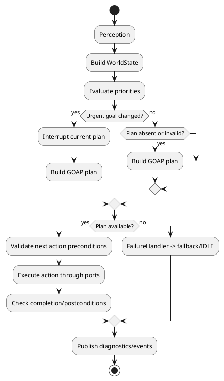

# RimWorldCraft — модуль Goal AI

## 1. Введение

`Goal AI` — модуль принятия решений NPC. Он превращает состояние `Citizen` и наблюдения мира в цель, план и последовательность исполняемых действий. Модуль поддерживает гибридную модель:

- поведенческое дерево выбирает срочную категорию поведения, прежде всего выживание;
- GOAP строит многошаговый план внутри выбранной цели;
- executor материализует действия через порты и постоянно проверяет их актуальность.

Модуль находится в `core.goal` и не зависит от Minecraft API. Он взаимодействует с [`module-npc-core.md`](module-npc-core.md) через summaries/events, с Building System через task contracts, а с navigation layer — через `IPathfinderPort`.

### 1.1 Ответственность

Goal AI отвечает за:

- восприятие релевантного состояния NPC и мира;
- динамическую оценку целей;
- построение и валидацию GOAP-планов;
- исполнение действий с timeout и postcondition checks;
- прерывание и перепланирование;
- очередь задач игрока/колонии;
- события выбора goal, plan и task progress.

### 1.2 Что не входит в модуль

Goal AI не владеет:

- needs, mood, traits, skills и death state — это NPC Core;
- ресурсами колонии и ownership строительных заказов — Colony/Building System;
- физическим положением Minecraft entity;
- реализацией pathfinding;
- генерацией storyteller incidents;
- Minecraft packet/UI implementation.

Goal AI может читать `CitizenSummary` и `NpcEnvironmentSnapshot`, но не импортирует `Citizen` aggregate напрямую. Он формирует `ActionIntent`, а адаптеры выполняют его через `IPathfinderPort`, `IInventoryPort`, `IBlockWorldPort`, `IEntitySpawnPort`, `ITimePort` и `ISaveLoadPort`.

## 2. Основные концепции и термины

| Термин | Определение |
|---|---|
| **Goal** | Желаемое состояние/намерение NPC: `EAT`, `SLEEP`, `BUILD`, `FIGHT` и т.д. |
| **Action** | Атомарная операция плана: `MOVE_TO`, `TAKE_ITEM`, `PLACE_BLOCK`, `ATTACK`. |
| **Plan** | Упорядоченный список действий, ведущий из текущего состояния к goal. |
| **Task** | Внешний или внутренний заказ работы с `taskId`, целью и требованиями; может порождать goal `WORK`/`BUILD`. |
| **Priority** | Динамическая оценка важности goal в диапазоне `1..100`. |
| **World State** | Снимок фактов, доступных planner: position, inventory, threats, resources, mood, health. |
| **Precondition** | Условие, которое должно быть истинным до action или goal. |
| **Effect** | Изменение World State после успешного action. |
| **Scheduler** | Компонент, выбирающий время/порядок simulation и задач. |
| **Executor** | Компонент, запускающий action и проверяющий его завершение. |
| **Дерево приоритетов** | Поведенческое дерево, выбирающее ветвь survival/work/social/idle. |
| **GOAP** | Goal-Oriented Action Planning: поиск цепочки действий по preconditions/effects/cost. |
| **Replan** | Построение нового плана после изменения мира, провала или более важной угрозы. |
| **Action intent** | Platform-neutral намерение адаптера, например «поставить блок в позиции». |

## 3. Архитектура принятия решений

### 3.1 Decision loop



### 3.2 Фазы цикла

1. **Perception:** `WorldStateObserver` получает NPC summary, inventory, nearby threats, tasks, environment и position.
2. **Priority Evaluation:** `PriorityEvaluator` рассчитывает goal scores с учётом survival hierarchy, traits, assignments и cooldowns.
3. **Planning:** `GOAPPlanner` ищет план в графе действий.
4. **Execution:** `ActionExecutor` исполняет одно действие за раз.
5. **Monitoring:** после каждого action и на периодическом interval проверяются preconditions, threats, target validity и goal relevance.
6. **Replanning:** при существенном изменении state текущий plan отменяется или продолжает выполнение согласно interruption policy.

### 3.3 Server authority

Decision loop, который меняет мир, выполняется на server simulation thread. Клиент может отображать выбранную goal и prediction, но не может самостоятельно поставить блок, переместить NPC или подтвердить action success.

## 4. Структура пакетов

```text
com.rimworldcraft.core.goal/
  aggregate/
    CitizenAI.java
  valueobject/
    Goal.java
    Action.java
    Plan.java
    WorldState.java
    ActionContext.java
    StateFact.java
    ActionCost.java
  action/
    ActionDefinition.java
    ActionRegistry.java
    Preconditions.java
    Effects.java
  priority/
    PriorityEvaluator.java
    PriorityTree.java
    PriorityModifier.java
  planning/
    GOAPPlanner.java
    PlanningGraph.java
    PlannerNode.java
    PlanningBudget.java
  execution/
    ActionExecutor.java
    ActionExecution.java
    ExecutionResult.java
  perception/
    WorldStateObserver.java
    PerceptionSnapshot.java
  task/
    TaskManager.java
    Task.java
  service/
    ReplanningTrigger.java
    FailureHandler.java
  event/
    GoalChangedEvent.java
    PlanCreatedEvent.java
    ActionStartedEvent.java
    ActionCompletedEvent.java
    PlanFailedEvent.java
    TaskAssignedEvent.java
    TaskCompletedEvent.java
  port/
    in/
    out/
  repository/
    ICitizenAIRepository.java
    ITaskRepository.java
  exception/
```

Инфраструктура:

```text
com.rimworldcraft.infrastructure.adapters.driving.goal/
com.rimworldcraft.infrastructure.adapters.driven.goal/
com.rimworldcraft.infrastructure.config.goal/
```

## 5. Модель Goal AI

### 5.1 `CitizenAI` — aggregate root

`CitizenAI` хранит decision state одного NPC. Он не является вторым `Citizen`: identity и needs принадлежат NPC Core, а AI хранит только goal/planning/execution state.

```java
public final class CitizenAI {
    private final CitizenId citizenId;
    private Goal currentGoal;
    private Plan currentPlan;
    private final Deque<Action> actionQueue;
    private boolean planning;
    private GameTick lastReplanTime;
    private final Map<GoalType, Integer> priorityLevels;
    private AIStatus status;

    public void tick(WorldState state, GameTick now) {
        if (status == AIStatus.SUSPENDED) return;
        if (needsReplanning(state, now)) {
            reevaluate(state, now);
        }
    }

    public void reevaluate(WorldState state, GameTick now) {
        Goal next = priorityEvaluator.evaluate(state);
        if (!Objects.equals(currentGoal, next)) {
            Goal old = currentGoal;
            currentGoal = next;
            pendingEvents.add(new GoalChangedEvent(
                    citizenId, old, next, GoalChangeReason.PRIORITY_CHANGED));
        }
        if (currentGoal != null) replan(state, now);
    }

    public void replan(WorldState state, GameTick now) {
        planning = true;
        Plan plan = planner.buildPlan(currentGoal, state);
        planning = false;
        if (plan == null) throw new PlanningFailedException(citizenId, currentGoal);
        currentPlan = plan;
        actionQueue.clear();
        actionQueue.addAll(plan.actions());
        lastReplanTime = now;
    }

    public Action executeNextAction() {
        if (actionQueue.isEmpty()) return null;
        return actionQueue.peek();
    }
}
```

В production агрегат получает policies/services через application layer; пример сокращён для иллюстрации.

Инварианты:

- `citizenId` immutable;
- `currentPlan` соответствует `currentGoal`;
- `planning == true` не может быть observable как исполняемый plan;
- `actionQueue` содержит только действия текущего плана;
- одновременно выполняется не более одного action;
- `lastReplanTime` не уходит назад;
- suspended/dead NPC не исполняет actions;
- plan length и planning time ограничены конфигурацией.

### 5.2 `Goal` — value object

```java
public record Goal(
        GoalType type,
        int priority,
        List<Precondition> preconditions,
        GoalTarget target,
        String targetAction
) {
    public Goal {
        if (priority < 1 || priority > 100) {
            throw new IllegalArgumentException("Goal priority must be 1..100");
        }
        preconditions = List.copyOf(preconditions);
    }
}

public enum GoalType {
    EAT, SLEEP, FLEE, WORK, BUILD, FIGHT, SOCIALIZE, IDLE
}
```

Priority — вычисленный snapshot, а не постоянное поле личности. `GoalTarget` содержит только Core identifiers/position.

### 5.3 `Action` — value object

```java
public record Action(
        ActionId id,
        ActionType type,
        int durationTicks,
        List<Precondition> preconditions,
        List<Effect> effects,
        ActionCost cost,
        ActionContextTemplate context
) {
    public Action {
        if (durationTicks < 0) throw new IllegalArgumentException("duration >= 0");
        preconditions = List.copyOf(preconditions);
        effects = List.copyOf(effects);
    }
}

public enum ActionType {
    MOVE_TO, TAKE_ITEM, PLACE_BLOCK, BREAK_BLOCK,
    USE_ITEM, DROP_ITEM, ATTACK, INTERACT
}
```

`Action` описывает domain capability, но реальный вызов делается executor/adapters. `ActionId` стабилен для diagnostics/config, а конкретный execution instance имеет `ActionExecutionId`.

### 5.4 `Plan` — value object

```java
public record Plan(
        UUID planId,
        Goal goal,
        List<Action> actions,
        int totalCost,
        PlanStatus status,
        GameTick createdAt
) {
    public Plan {
        if (actions.isEmpty() && goal.type() != GoalType.IDLE) {
            throw new IllegalArgumentException("Non-idle plan must contain actions");
        }
        if (totalCost < 0) throw new IllegalArgumentException("cost >= 0");
        actions = List.copyOf(actions);
    }
}
```

Plan immutable; progress хранится отдельно в `ActionExecutionState`/`CitizenAI`, чтобы не мутировать published plan.

### 5.5 `WorldState` — value object

```java
public record WorldState(
        GridPosition citizenPosition,
        Map<ResourceType, Integer> inventoryItems,
        List<EntitySnapshot> nearbyEnemies,
        Map<ResourceType, Integer> availableResources,
        Optional<GridPosition> currentBlockTarget,
        int mood,
        int health,
        Set<StateFact> facts,
        GameTick observedAt
) {
    public WorldState {
        inventoryItems = Map.copyOf(inventoryItems);
        availableResources = Map.copyOf(availableResources);
        nearbyEnemies = List.copyOf(nearbyEnemies);
        facts = Set.copyOf(facts);
        if (mood < 0 || mood > 100 || health < 0 || health > 100) {
            throw new IllegalArgumentException("mood/health must be 0..100");
        }
    }
}
```

WorldState — snapshot и не должен изменяться во время поиска. Новый observation создаёт новый snapshot.

### 5.6 `ActionContext` — value object

```java
public record ActionContext(
        CitizenId citizenId,
        WorldState worldState,
        Optional<GridPosition> targetBlockPos,
        Optional<EntityId> targetEntityId,
        Optional<ResourceType> itemRequired,
        Map<String, Object> additionalData
) {
    public ActionContext {
        additionalData = Map.copyOf(additionalData);
    }
}
```

`additionalData` содержит только whitelisted serializable values. Нельзя передавать туда `Level`, `Entity`, `ItemStack`, callback или mutable service.

## 6. Приоритеты и дерево решений

### 6.1 Иерархия

```text
Survival
├── EAT
├── SLEEP
└── FLEE / FIGHT
Work
├── BUILD
└── WORK
Social
└── SOCIALIZE
Fallback
└── IDLE
```

Выбор — не статический порядок: фактический score вычисляется из state, urgency, traits, assignments, distance и cooldown. Survival goals имеют защитный floor, чтобы работа не перекрывала критическую потребность.

### 6.2 Базовые приоритеты

| Цель | Базовый приоритет | Условие активации |
|---|---:|---|
| `EAT` | 100 | hunger `< 30%` |
| `SLEEP` | 95 | fatigue `< 30%` |
| `FLEE` | 90 | health `< 40%` или враг рядом |
| `BUILD` | 75 | build task есть и hunger `> 50%` |
| `WORK` | 70 | assigned zone/task есть и hunger `> 50%` |
| `SOCIALIZE` | 40 | mood `< 40%` и hunger `> 60%` |
| `IDLE` | 10 | подходящая goal отсутствует |

`FIGHT` выбирается вместо `FLEE`, если есть враг, NPC имеет combat capability и policy считает engagement допустимым. Его базовый score обычно `85`, но он не должен игнорировать lethal health state.

### 6.3 Priority evaluator

```java
public final class PriorityEvaluator {
    private final PriorityTree tree;
    private final List<PriorityModifier> modifiers;

    public List<Goal> evaluateAll(WorldState state) {
        return tree.candidates(state).stream()
                .map(goal -> applyModifiers(goal, state))
                .filter(goal -> goal.priority() >= 1)
                .sorted(Comparator.comparingInt(Goal::priority).reversed())
                .toList();
    }

    public Goal evaluate(WorldState state) {
        return evaluateAll(state).stream().findFirst()
                .orElse(new Goal(GoalType.IDLE, 10, List.of(),
                        GoalTarget.none(), "idle"));
    }
}
```

### 6.4 Динамическая коррекция

Примеры:

- trait `workaholic`: `WORK +15`, но только если survival floor не нарушен;
- trait `brave`: `FIGHT +10`, `FLEE -5`, если health выше configured threshold;
- trait `social`: `SOCIALIZE +12`;
- недавняя травма: `FLEE +20`;
- активная задача игрока с высоким priority: `BUILD +10`;
- повторный провал действия: соответствующая goal получает temporary penalty;
- distance/cost: далёкая цель получает cost penalty.

Модификаторы composable, bounded и имеют `sourceId`, чтобы не применяться дважды.

## 7. Планировщик GOAP

### 7.1 Контракт

```java
public interface GOAPPlanner {
    Optional<Plan> buildPlan(Goal goal, WorldState currentState);
}
```

Planner принимает immutable action definitions из `actions.json` и возвращает plan либо empty при невозможности.

### 7.2 Граф действий

- node — `PlanningNode` с facts, cost, depth и path;
- edge — применимое action, чьи preconditions истинны;
- state transition — `currentFacts - deleteEffects + addEffects`;
- goal — набор desired facts;
- cost — base cost + distance/risk/resource penalties.

### 7.3 A* / backward search

Рекомендуется bounded A* или backward search:

1. создать initial state из `WorldState`;
2. получить desired facts выбранного goal;
3. выбрать action candidates, чьи effects приближают к desired facts;
4. проверить preconditions;
5. создать successor state;
6. вычислить `f(n) = g(n) + h(n)`;
7. остановиться при достижении goal facts;
8. восстановить path и создать immutable `Plan`.

Heuristic `h(n)` должна быть admissible или bounded; например, количество невыполненных facts с минимальной стоимостью их achiever action.

### 7.4 Ограничения

- максимальная глубина по умолчанию: `10` действий;
- максимальный planning time: `5 ms` на NPC или configurable budget;
- максимальное число expanded nodes: `500`;
- deterministic tie-breaking по `ActionId`;
- запрет циклов состояний через visited-state hash;
- plan должен содержать не более `goal-settings.maxPlanLength` действий;
- при timeout возвращается `PlanningFailed`, NPC не блокируется.

### 7.5 Пример строительства стены

Цель: `wall_segment_built`.

```text
initial facts:
  at_home = true
  has_oak = false
  target_empty = true

plan:
  MOVE_TO(storage)
  TAKE_ITEM(oak_log, 1)
  MOVE_TO(target)
  PLACE_BLOCK(oak_planks)
```

Для повторяющихся сегментов Building System создаёт отдельные tasks или composite task. Planner не должен бесконечно разворачивать `REPEAT`; число повторов приходит из bounded task payload.

### 7.6 Реализация

```java
public final class AStarGoapPlanner implements GOAPPlanner {
    private final ActionRegistry actions;
    private final PlanningBudget budget;
    private final Heuristic heuristic;

    @Override
    public Optional<Plan> buildPlan(Goal goal, WorldState state) {
        long deadline = System.nanoTime() + budget.maxNanos();
        PriorityQueue<PlannerNode> open = new PriorityQueue<>(PlannerNode.ORDER);
        Set<StateHash> visited = new HashSet<>();
        open.add(PlannerNode.start(state, goal));

        while (!open.isEmpty() && System.nanoTime() < deadline) {
            PlannerNode node = open.poll();
            if (goal.satisfiedBy(node.state())) return Optional.of(node.toPlan());
            if (node.depth() >= budget.maxDepth()) continue;
            if (!visited.add(node.state().hash())) continue;
            for (Action action : actions.applicableTo(node.state())) {
                WorldState next = action.effects().apply(node.state());
                open.add(node.expand(action, next,
                        node.cost() + action.cost().value()
                                + heuristic.estimate(next, goal)));
            }
        }
        return Optional.empty();
    }
}
```

## 8. Исполнитель действий

### 8.1 `ActionExecutor`

```java
public interface ActionExecutor {
    ExecutionResult executeNext(ActionContext context, Action action);
    boolean isActionComplete(ActionExecutionId executionId, WorldState state);
    void onActionFail(ActionExecutionId executionId, ActionFailure failure);
}
```

### 8.2 Жизненный цикл

1. Проверить action preconditions на актуальном `WorldState`.
2. Создать execution record с timeout/deadline.
3. Опубликовать `ActionStartedEvent`.
4. Вызвать соответствующий intent/port adapter.
5. Ожидать duration или external completion signal.
6. Пересобрать observation.
7. Проверить effects/postconditions.
8. Опубликовать `ActionCompletedEvent(success=true/false)`.
9. При failure вызвать `FailureHandler` и решить: retry, replan, fallback или task failure.

### 8.3 Маппинг действий на порты

| Action type | Порт | Пример вызова |
|---|---|---|
| `MOVE_TO` | `IPathfinderPort` | `findPath(PathRequest)` |
| `TAKE_ITEM` | `IInventoryPort` | `reserve` + `commit` |
| `PLACE_BLOCK` | `IBlockWorldPort` | `apply(BlockOperation)` |
| `BREAK_BLOCK` | `IBlockWorldPort` | `apply(BlockOperation)` |
| `USE_ITEM` | `IInventoryPort`/`IBlockWorldPort` | consume/use intent |
| `DROP_ITEM` | `IInventoryPort` | transfer/drop intent |
| `ATTACK` | `IEntitySpawnPort`/combat port | `applyIntent(AttackIntent)` |
| `INTERACT` | `IEntitySpawnPort`/world port | `applyIntent(InteractionIntent)` |

Порт называется capability, а не копией Minecraft API. Например, для `PLACE_BLOCK` Core вызывает:

```java
BlockMutationResult result = blockWorldPort.apply(
        new BlockOperation.Place(context.targetBlockPos().orElseThrow(), "minecraft:oak_planks"));
```

Адаптер сам преобразует position/block ID в Minecraft types и проверяет server thread.

### 8.4 Исполнитель

```java
public final class DefaultActionExecutor implements ActionExecutor {
    private final ActionPortRouter router;
    private final ITimePort time;
    private final IEventBusPort events;
    private final ActionExecutionRepository executions;

    @Override
    public ExecutionResult executeNext(ActionContext context, Action action) {
        if (!Preconditions.allSatisfied(action.preconditions(), context.worldState())) {
            return ExecutionResult.failed("PRECONDITION_FAILED");
        }
        ActionExecution execution = executions.start(
                context.citizenId(), action, time.currentTick(context.worldState().worldId()));
        events.publish(ActionStartedEvent.from(execution));
        try {
            router.route(action, context);
            return ExecutionResult.started(execution.id());
        } catch (PortAccessException ex) {
            return ExecutionResult.failed("PORT_UNAVAILABLE");
        }
    }
}
```

## 9. Доменные сервисы

### 9.1 `PriorityEvaluator`

Методы:

```java
List<Goal> evaluateAll(WorldState state);
Goal evaluate(WorldState state);
int score(GoalType type, WorldState state);
```

Зависимости: `GoalConfigPort`, `CitizenSummaryPort`, traits/mood snapshot, `TaskManager` query. Не читает `Citizen` aggregate напрямую.

### 9.2 `WorldStateObserver`

```java
WorldState observe(CitizenId citizenId, ObservationScope scope);
```

Зависимости: `IBlockWorldPort`, `IInventoryPort`, `IEntitySpawnPort`, `IPathfinderPort`, NPC summary port, task query port, `ITimePort`.

Observer использует caching/budget. Он не должен выполнять mutation; его обязанность — собрать facts.

### 9.3 `TaskManager`

```java
TaskAssignmentResult assign(Task task, CitizenId citizenId);
List<Task> availableFor(CitizenId citizenId, WorldState state);
void markProgress(TaskId taskId, TaskProgress progress);
void complete(TaskId taskId, TaskResult result);
```

TaskManager получает строительные задания от Building System/Colony, проверяет ownership/requirements и возвращает `TaskView`. Он не хранит полный Building aggregate.

### 9.4 `ReplanningTrigger`

```java
boolean shouldReplan(WorldState previous, WorldState current, Plan plan);
ReplanReason reason(...);
```

Triggers:

- critical need;
- new enemy/threat;
- target destroyed/occupied;
- resource disappeared;
- action timeout/failure;
- task cancelled/changed;
- current goal no longer highest priority;
- external event from NPC/Colony/Storyteller.

### 9.5 `FailureHandler`

```java
FailureDecision handle(ActionFailure failure, CitizenAIState state);
```

Возможные решения: `RETRY`, `REPLAN`, `SWITCH_GOAL`, `FAIL_TASK`, `IDLE`, `NOTIFY_PLAYER`. Retry имеет bounded count/backoff. Resources missing обычно ведут к `REPLAN`; task reports shortage в Building System.

### 9.6 `PlanMonitor`

```java
PlanValidation validate(Plan plan, WorldState state);
```

Проверяет next action, goal relevance, timeout и state facts. Этот сервис отделяет мониторинг от executor, чтобы executor не стал responsible за planner policy.

## 10. Доменные события

| Событие | Публикует | Payload | Основные подписчики |
|---|---|---|---|
| `GoalChangedEvent` | `CitizenAI`/decision service | `citizenId`, old/new goal, reason | NPC Core, UI, Storyteller |
| `PlanCreatedEvent` | `GOAPPlanner`/AI service | `citizenId`, goal, plan ID/actions summary | diagnostics, UI, analytics |
| `ActionStartedEvent` | `ActionExecutor` | citizen, execution/action type, target | NPC Core, Building System, Storyteller |
| `ActionCompletedEvent` | `ActionExecutor` | citizen, action, success, result | NPC Core skill XP, task manager, UI |
| `PlanFailedEvent` | `FailureHandler` | citizen, plan ID/goal, reason | Building System, Player/UI, Storyteller |
| `TaskAssignedEvent` | `TaskManager` | citizen, task ID/type, source | NPC Core, Building System |
| `TaskCompletedEvent` | `TaskManager` | citizen, task ID, result | Building System, NPC Core, Colony, UI |

### 10.1 Event examples

```java
public record ActionCompletedEvent(
        UUID eventId,
        WorldId worldId,
        CitizenId citizenId,
        ActionType actionType,
        ActionExecutionId executionId,
        boolean success,
        String resultCode,
        GameTick occurredAt,
        String correlationId,
        int schemaVersion
) implements DomainEvent {}
```

`ActionCompletedEvent` передаёт NPC Core reason для skill XP, но не изменяет skill сам. Building System принимает `TaskCompletedEvent` и обновляет строительный progress. Storyteller может использовать массовые failures, heroic actions или combat actions как narrative facts.

## 11. Сценарии использования

### 11.1 Ежедневный цикл принятия решений

```text
Server tick -> CitizenAI.tick()
CitizenAI -> WorldStateObserver: observe()
Observer -> NPC summary/config/ports: collect facts
CitizenAI -> PriorityEvaluator: evaluate(WorldState)
PriorityEvaluator --> CitizenAI: highest Goal
CitizenAI -> ReplanningTrigger: compare current plan
alt goal/plan invalid
  CitizenAI -> GOAPPlanner: buildPlan(goal, state)
  GOAPPlanner --> CitizenAI: Plan
  CitizenAI -> EventBus: PlanCreatedEvent
end
CitizenAI -> ActionExecutor: executeNext(action)
ActionExecutor -> Ports: route action intent
ActionExecutor -> EventBus: ActionStarted/Completed
```

План не строится на каждом tick, если текущий goal/plan валиден и replan interval не истёк.

### 11.2 Выполнение строительной задачи

```text
Player -> Building System: place ghost block
Building System -> TaskManager: create BuildTask
TaskManager -> EventBus: TaskAssignedEvent
Goal AI -> TaskManager: availableFor(citizen)
PriorityEvaluator: BUILD score = 75
GOAPPlanner: MOVE_TO_STORAGE -> TAKE_WOOD -> MOVE_TO_TARGET -> PLACE_BLOCK
ActionExecutor -> IPathfinderPort: path to storage
ActionExecutor -> IInventoryPort: reserve/commit wood
ActionExecutor -> IPathfinderPort: path to target
ActionExecutor -> IBlockWorldPort: place block
ActionExecutor -> EventBus: ActionCompletedEvent
TaskManager -> Building System: progress update
TaskManager -> EventBus: TaskCompletedEvent
```

Все target positions проходят `WorldId` и block validity checks. При отсутствии ресурса task не считается завершённой.

### 11.3 Реакция на угрозу

```text
Current plan: build wall
WorldStateObserver -> IEntitySpawnPort/World facts: enemy detected
ReplanningTrigger -> CitizenAI: urgent interruption
PriorityEvaluator: FLEE/FIGHT outranks BUILD
CitizenAI -> EventBus: GoalChangedEvent
CitizenAI -> GOAPPlanner: build flee/fight plan
ActionExecutor: cancel current movement/build action safely
ActionExecutor -> IPathfinderPort/IEntitySpawnPort: execute new plan
```

Воин может выбрать `FIGHT`, если combat policy разрешает; слабый/раненый NPC выбирает `FLEE`. Уже применённый `PLACE_BLOCK` не откатывается автоматически.

### 11.4 Провал плана из-за отсутствия дерева

```text
NPC -> IPathfinderPort: move to storage
NPC -> IInventoryPort: TAKE_ITEM(oak_log)
InventoryPort --> ActionExecutor: unavailable
ActionExecutor -> EventBus: ActionCompleted(success=false)
FailureHandler -> EventBus: PlanFailedEvent
PriorityEvaluator -> Goal: WORK/CHOP_WOOD
GOAPPlanner -> Plan: MOVE_TO_FOREST -> CHOP_TREE -> TAKE_ITEM
TaskManager -> Player/UI: resource shortage notification
```

FailureHandler ограничивает retries и предотвращает loop «storage → empty storage».

### 11.5 Сохранение и восстановление

```text
World save -> ISaveLoadPort: save CitizenAI snapshot
World load -> ISaveLoadPort: load snapshot
AI repository -> validate plan schema/status
alt plan still valid
  restore currentGoal/currentPlan/action queue
else stale/invalid
  discard plan and request replan
end
```

План не должен восстанавливаться как completed action без проверки world postconditions.

## 12. Конфигурация

### 12.1 `goal-settings.json`

Источник: `config/rwc/goal/goal-settings.json`.

```json
{
  "$schema": "rwc://schemas/goal/goal-settings.schema.json",
  "version": 1,
  "decisionIntervalTicks": 10,
  "replanIntervalTicks": 40,
  "maxPlanningTimeMs": 5,
  "maxPlanLength": 10,
  "maxExpandedNodes": 500,
  "actionTimeoutTicks": 200,
  "maxActionRetries": 2,
  "priorityDefaults": {
    "EAT": 100,
    "SLEEP": 95,
    "FLEE": 90,
    "FIGHT": 85,
    "BUILD": 75,
    "WORK": 70,
    "SOCIALIZE": 40,
    "IDLE": 10
  },
  "traitPriorityModifiers": {
    "rwc:workaholic": { "WORK": 15, "BUILD": 10 },
    "rwc:brave": { "FIGHT": 10, "FLEE": -5 },
    "rwc:social": { "SOCIALIZE": 12 }
  },
  "survivalFloors": {
    "EAT": 30,
    "SLEEP": 30,
    "FLEE_HEALTH": 40
  }
}
```

Парсер: `GoalSettingsJsonParser`; runtime: `GoalSettingsSnapshot`; используется `PriorityEvaluator`, `CitizenAI`, `GOAPPlanner`, `ActionExecutor`, `FailureHandler`.

### 12.2 `actions.json`

```json
{
  "$schema": "rwc://schemas/goal/actions.schema.json",
  "version": 1,
  "actions": [
    {
      "actionId": "move_to",
      "type": "MOVE_TO",
      "baseCost": 5,
      "durationTicks": 20,
      "preconditions": ["target_exists", "target_reachable"],
      "effects": ["at_target"],
      "parameters": { "maxDistance": 128 }
    },
    {
      "actionId": "take_oak_log",
      "type": "TAKE_ITEM",
      "baseCost": 3,
      "durationTicks": 10,
      "preconditions": ["at_storage", "storage_has_minecraft:oak_log"],
      "effects": ["has_minecraft:oak_log"],
      "parameters": { "itemId": "minecraft:oak_log", "count": 1 }
    },
    {
      "actionId": "place_oak_planks",
      "type": "PLACE_BLOCK",
      "baseCost": 10,
      "durationTicks": 20,
      "preconditions": ["at_target", "has_minecraft:oak_planks", "target_block_is_empty"],
      "effects": ["block_placed", "item_consumed"],
      "parameters": { "blockId": "minecraft:oak_planks" }
    }
  ]
}
```

Parser мапит raw JSON в `ActionDefinition`, затем semantic validator проверяет:

- unique `actionId`;
- valid `ActionType`;
- non-negative cost/duration;
- known fact syntax;
- effects/preconditions не содержат запрещённые operations;
- parameters соответствуют type;
- max plan search complexity.

### 12.3 Связанные конфиги

| Файл | Как используется |
|---|---|
| `traits.json` | NPC Core предоставляет trait modifiers для `PriorityEvaluator` |
| `skills.json` | NPC Core/Goal AI проверяют required skill в `WorldState`/task eligibility |
| `colony-settings.json` | Colony/Building System предоставляет tasks, zones и resource summaries |
| `prefabs.json` | Building System формирует bounded build tasks |
| `npc-settings.json` | NPC Core формирует needs/mood snapshot |
| `world-biome-modifiers.json` | World context поставляет environment facts |

### 12.4 Маппинг JSON в Java

```java
public final class GoalConfigRepository {
    private final IConfigPort config;

    public GoalSettingsSnapshot settings() {
        return config.get(
                new ConfigKey("goal", "goal-settings"),
                GoalSettingsSnapshot.class).value();
    }

    public ActionRegistry actions() {
        ActionsSnapshot snapshot = config.get(
                new ConfigKey("goal", "actions"),
                ActionsSnapshot.class).value();
        return ActionRegistry.from(snapshot.actions());
    }
}
```

Raw JSON не передаётся planner. Snapshot строится один раз при load/reload и immutable.

## 13. Порты Goal AI

### 13.1 `IPathfinderPort`

Используется `MOVE_TO` и reachability checks:

```java
PathResult findPath(PathRequest request);
ReachabilityResult canReach(GridPosition from, GridPosition to,
                            MovementProfile profile);
void cancel(PathRequestId id);
```

При invalid path executor возвращает action failure, а planner может выбрать альтернативную цель/маршрут.

### 13.2 `IInventoryPort`

Используется `TAKE_ITEM`, `USE_ITEM`, `DROP_ITEM`:

```java
InventorySnapshot read(InventoryRef ref);
ReservationResult reserve(InventoryRef ref, ResourceRequest request);
CommitResult commit(ReservationId id);
ReleaseResult release(ReservationId id);
```

Reservation обязательна для ресурсов, нужных строительному или craft action. Commit подтверждается postcondition.

### 13.3 `IBlockWorldPort`

Используется `PLACE_BLOCK`, `BREAK_BLOCK`, `CHECK_BLOCK`:

```java
BlockSnapshot inspect(GridPosition position);
BlockMutationResult apply(BlockOperation operation);
EnvironmentFact environmentAt(GridPosition position);
```

Адаптер проверяет unloaded chunk, permissions, server thread и соответствие target.

### 13.4 `IEntitySpawnPort`

Используется для `ATTACK`, `INTERACT`, nearby enemy/entity facts:

```java
Optional<EntitySnapshot> find(EntityId entityId);
void applyIntent(EntityIntent intent);
SpawnResult spawn(SpawnIntent intent);
```

В будущем combat capability может быть отдельным портом; Goal AI зависит от minimal intent contract.

### 13.5 `ITimePort`

Используется для decision interval, action duration, timeout, retry backoff и save timestamps:

```java
GameTick currentTick(WorldId worldId);
boolean elapsed(GameTick since, Duration duration, WorldId worldId);
```

Нельзя применять `System.currentTimeMillis()` в Core для игрового времени.

### 13.6 `ISaveLoadPort`

Используется для сохранения `CitizenAI` snapshot, current plan и tasks:

```java
Optional<SaveDocument> load(SaveKey key);
void save(SaveKey key, SaveDocument document);
```

Сохраняются только serializable plan/action DTO и IDs. Runtime handles, callbacks и Minecraft entities отбрасываются и восстанавливаются через observation.

### 13.7 `IEventBusPort`

Используется для подписки на `NPCMoodChangedEvent`, `NPCDeathEvent`, `WorkAssigned`, `ColonyTaskCancelled`, а также публикации Goal AI events:

```java
void publish(EventEnvelope event);
Subscription subscribe(EventFilter filter, EventHandler handler);
```

Смерть NPC переводит CitizenAI в suspended/dead state; изменение mood может вызвать replan.

### 13.8 `IGuiPort` / query boundary

Если GUI отображает plan/history/debug:

```java
void showPlan(PlayerId playerId, CitizenId citizenId, PlanView view);
void notifyTaskFailure(PlayerId playerId, TaskFailureView failure);
```

Предпочтительно GUI adapter подписывается на observer/query layer. Core goal не вызывает Minecraft screen напрямую.

## 14. Обработка ошибок и исключений

### 14.1 Исключения

```java
public final class GoalNotFoundException extends RuntimeException {
    public GoalNotFoundException(CitizenId id) {
        super("No eligible goal for citizen " + id);
    }
}

public final class PlanningFailedException extends RuntimeException {
    public PlanningFailedException(CitizenId id, Goal goal) {
        super("Unable to build plan for " + id + ": " + goal.type());
    }
}

public final class ActionExecutionException extends RuntimeException {
    public ActionExecutionException(String code) { super(code); }
}

public final class PlanInterruptedException extends RuntimeException {
    public PlanInterruptedException(String reason) { super(reason); }
}

public final class TaskAssignmentException extends RuntimeException {
    public TaskAssignmentException(String code) { super(code); }
}
```

### 14.2 Политика обработки

| Ошибка | Реакция Core |
|---|---|
| no eligible goal | выбрать `IDLE`, диагностировать, не блокировать NPC |
| planning timeout | `PlanFailedEvent`, backoff и fallback goal |
| precondition failed | refresh state → replan; не выполнять blindly |
| port unavailable | retry bounded, затем replan/defer |
| action timeout | cancel intent, release reservation, failure handler |
| plan interrupted | сохранить interruption reason, приоритетная replan |
| task assignment failed | сообщить Building/Colony, выбрать другую работу |
| save failure | retry/degraded in-memory state, log with correlation ID |

### 14.3 Бесконечные циклы

- max retries per action;
- max replans per simulation window;
- visited-state hash в planner;
- exponential/backoff delay для повторного failed goal;
- `IDLE` fallback после исчерпания budget;
- метрика `ai_replan_loop_detected`.

Minecraft-specific exceptions переводятся в Core `PortAccessException` в adapter. `System.out` и stack trace игроку запрещены.

## 15. Тестирование модуля

### 15.1 Unit-тесты `PriorityEvaluator`

Проверить:

- hunger `20` выбирает `EAT` выше BUILD;
- fatigue `20` выбирает `SLEEP`;
- enemy + low health выбирает `FLEE`;
- brave combat NPC может выбрать `FIGHT`;
- workaholic modifier ограничен survival floor;
- отсутствующие tasks дают `IDLE`/другую работу;
- tie-breaking deterministic.

```java
@Test
void hungryCitizenChoosesEatingOverBuilding() {
    WorldState state = WorldStateFixtures.builder()
            .hunger(20)
            .fatigue(80)
            .assignedBuildTask(true)
            .build();

    Goal goal = evaluator.evaluate(state);

    assertThat(goal.type()).isEqualTo(GoalType.EAT);
}
```

### 15.2 Unit-тесты `GOAPPlanner`

Используется известный in-memory action graph:

```java
@Test
void buildsPlanForOakWall() {
    WorldState initial = WorldStateFixtures.atHomeWithoutWood();
    Goal goal = Goals.buildOakWall();

    Optional<Plan> plan = planner.buildPlan(goal, initial);

    assertThat(plan).isPresent();
    assertThat(plan.orElseThrow().actions())
            .extracting(Action::type)
            .containsExactly(
                    ActionType.MOVE_TO,
                    ActionType.TAKE_ITEM,
                    ActionType.MOVE_TO,
                    ActionType.PLACE_BLOCK);
}
```

Также проверить timeout, max depth, unreachable target, cycles, deterministic ordering и отсутствие доступного action.

### 15.3 Unit-тесты `ActionExecutor`

Fake ports:

- `RecordingPathfinderPort`;
- `InMemoryInventoryPort`;
- `FakeBlockWorldPort`;
- `RecordingEventBus`;
- `FixedTimePort`.

Cases:

- precondition failure не вызывает port;
- successful place block публикует start/completed;
- postcondition failure помечает action failed;
- timeout освобождает reservation;
- повторное completion не дублирует event;
- interruption отменяет текущий intent.

### 15.4 Интеграционные тесты

С test adapters/test world проверить:

1. NPC строит block через реальный `IBlockWorldPort` adapter.
2. `MOVE_TO` получает path и entity достигает target.
3. `TAKE_ITEM` корректно взаимодействует с container inventory.
4. save/load восстанавливает current goal, plan, queue и task IDs.
5. stale plan после world reload безопасно discarded/replanned.
6. event subscriptions NPC/Colony/Building работают с versioned envelopes.
7. Forge и Fabric adapter implementations проходят единый contract suite.

### 15.5 Acceptance Gherkin

```gherkin
Feature: NPC goal selection

  Scenario: Hungry NPC chooses eating over building
    Given a citizen with hunger 20 and an assigned build task
    And food is available in the colony storage
    When the citizen AI ticks
    Then the selected goal is EAT
    And the citizen moves to the food storage
    And the build task remains pending

  Scenario: NPC replans when an enemy appears
    Given a citizen is executing a build plan
    When an enemy appears within the configured threat distance
    Then the current plan is interrupted
    And the selected goal is FLEE or FIGHT according to the citizen profile
    And GoalChangedEvent is published
```

### 15.6 Coverage

Целевой порог: не менее `80%` для Goal AI aggregate/services; критические planning/execution branches должны иметь explicit tests. Coverage gate дополняется mutation tests для priority floors, preconditions, effects, timeout и interruption.

## 16. DoD модуля Goal AI

- [ ] Все агрегаты покрыты юнит-тестами с покрытием не менее **80%**.
- [ ] Все доменные сервисы покрыты юнит-тестами.
- [ ] `GOAPPlanner` строит планы для основных целей `EAT`, `SLEEP`, `BUILD`, `FIGHT`.
- [ ] Реализованы все доменные события и их публикация с versioned envelope.
- [ ] Написаны интеграционные тесты с реальными/contract adapters.
- [ ] `goal-settings.json` и `actions.json` корректно загружаются, валидируются и мапятся.
- [ ] ArchUnit-правила для модуля проходят.
- [ ] Проверены plan failure, retry, fallback и переключение на другие goals.
- [ ] Проверены action timeout, cancellation и освобождение reservations.
- [ ] Доказано отсутствие бесконечных replanning loops.
- [ ] Client не может самостоятельно подтвердить world mutation.
- [ ] Документированы связи с NPC Core, Building System и Pathfinding Layer.

## 17. ArchUnit-правила для Goal AI

### 17.1 Запрет Minecraft API

```java
noClasses()
    .that().resideInAnyPackage("com.rimworldcraft.core.goal..")
    .should().dependOnClassesThat()
    .resideInAnyPackage(
        "net.minecraft..",
        "net.minecraftforge..",
        "net.fabricmc..",
        "com.mojang.blaze3d.."
    );
```

### 17.2 Разрешённые зависимости Core

```java
noClasses()
    .that().resideInAnyPackage("com.rimworldcraft.core.goal..")
    .should().dependOnClassesThat()
    .resideInAnyPackage(
        "com.rimworldcraft.infrastructure..",
        "com.rimworldcraft.client.."
    );
```

Goal AI может зависеть от собственных packages, `core.shared`, `core.ports` и versioned contracts.

### 17.3 Запрет прямого обращения к `Citizen` и `Colony`

```java
noClasses()
    .that().resideInAnyPackage("com.rimworldcraft.core.goal..")
    .should().dependOnClassesThat()
    .haveSimpleName("Citizen");

noClasses()
    .that().resideInAnyPackage("com.rimworldcraft.core.goal..")
    .should().dependOnClassesThat()
    .haveSimpleName("Colony");
```

Разрешены `CitizenId`, `CitizenSummary`, `ColonyId`, `TaskView` и события.

### 17.4 Порты — интерфейсы

```java
classes()
    .that().resideInAnyPackage("com.rimworldcraft.core.goal.port..")
    .should().beInterfaces();
```

### 17.5 Адаптеры реализуют порты

```java
classes()
    .that().resideInAnyPackage("com.rimworldcraft.infrastructure.adapters.driven.goal..")
    .and().haveSimpleNameEndingWith("Adapter")
    .should().implement(
        JavaClass.Predicates.resideInAnyPackage("com.rimworldcraft.core.goal.port.out.."));
```

### 17.6 Driving adapters не используют driven adapters

```java
noClasses()
    .that().resideInAnyPackage("com.rimworldcraft.infrastructure.adapters.driving.goal..")
    .should().dependOnClassesThat()
    .resideInAnyPackage(
        "com.rimworldcraft.core.goal.port.out..",
        "com.rimworldcraft.infrastructure.adapters.driven.."
    );
```

### 17.7 Public aggregate methods покрыты тестами

ArchUnit не заменяет coverage analysis. CI обязан проверять:

```text
JaCoCo: CitizenAI >= 80% line + branch coverage
Mutation tests: priority, planning, preconditions, timeout, interruption
GoalAiApiTest: каждый публичный behavior method вызывается тестом
```

### 17.8 Запрет `System.out`

```java
noClasses()
    .that().resideInAnyPackage("com.rimworldcraft.core.goal..")
    .should().accessClassesThat()
    .belongToAnyOf(System.class);
```

В production используется проектный logger/observability port.

## 18. Эволюция и расширение

### 18.1 Новые цели

1. Добавить `GoalType` или namespaced goal definition.
2. Описать activation/preconditions и priority policy.
3. Добавить action graph coverage.
4. Добавить survival floor/interruption semantics.
5. Добавить unit, planner и acceptance tests.
6. Обновить `goal-settings.json`, docs и schema.

`PriorityEvaluator` должен использовать registry/strategy, а не giant switch.

```java
public interface GoalPolicy {
    boolean eligible(WorldState state);
    Goal evaluate(WorldState state);
}
```

### 18.2 Новые действия

Новое action добавляется data-first через `actions.json`, если оно выражается существующей capability. Для уникальной логики создаётся `ActionHandler` в application/infrastructure, но planner видит только preconditions/effects.

```java
public interface ActionHandler {
    ActionExecutionResult execute(ActionContext context, Action action);
    boolean supports(ActionType type);
}
```

### 18.3 Новые алгоритмы планирования

`GOAPPlanner` должен оставаться интерфейсом. Можно добавить:

- `AStarGoapPlanner`;
- `BackwardGoapPlanner`;
- `HTNPlanner` для иерархических tasks;
- `ReactivePlanner` для коротких survival reactions.

```java
public interface Planner {
    Optional<Plan> buildPlan(Goal goal, WorldState state, PlanningBudget budget);
}
```

Decision service выбирает planner strategy по goal type/config, не меняя `CitizenAI` contract.

### 18.4 HTN без нарушения границ

HTN task decomposes compound goal (`BuildHouse`) в subtasks (`GatherWood`, `BuildWalls`, `BuildRoof`). Каждый primitive task мапится на существующий `Action`. Shared effects/preconditions используют те же Core facts; Minecraft API остаётся в adapters.

### 18.5 Новые perception facts

Новый факт добавляется в `StateFact`/`WorldState` только после определения:

- owner source;
- freshness/TTL;
- serialization;
- planner relevance;
- security/authority;
- tests.

Не следует добавлять каждый Minecraft block в WorldState: snapshots должны быть минимальными и bounded.

### 18.6 Learning и adaptive priorities

Если позже появится AI learning, learned values должны быть отдельным policy/projection. Нельзя позволять ML-модели напрямую мутировать aggregate или обходить safety floors. Configuration and deterministic fallback обязательны для reproducibility.

## 19. Безопасность, производительность и наблюдаемость

- planning budget ограничивается на NPC и tick;
- perception использует cache/TTL и batching;
- action execution serializes mutations per citizen;
- client commands проходят Player authorization и task ownership checks;
- target position/entity IDs проверяются на world scope;
- event handlers идемпотентны;
- log содержит `citizenId`, `planId`, `actionExecutionId`, `correlationId`, но не Minecraft object dump;
- метрики: planning latency, expanded nodes, replans, failed actions, stuck NPC, timeout count.

## 20. Связи с другими документами

- [`system-overview.md`](system-overview.md) — контейнеры, общие порты, server authority и simulation lifecycle.
- [`bounded-contexts.md`](bounded-contexts.md) — границы NPC/Colony/World/Player/Storyteller и правила межконтекстных событий.
- [`hexagonal-architecture.md`](hexagonal-architecture.md) — driving/driven ports, DI, adapter mapping и Core isolation.
- [`data-dictionaries.md`](data-dictionaries.md) — JSON conventions, schema versioning и связанные config files.
- [`module-npc-core.md`](module-npc-core.md) — needs, mood, traits, skills, `CitizenSummary` и NPC events.
- `module-building-system.md` — ghost blocks, construction tasks, requirements и task progress.
- `pathfinding-layer.md` — `IPathfinderPort`, navigation backends и movement execution.
- `module-colony-manager.md` — resources, zones, colony assignments и player orders.
- `module-storyteller.md` — использование Goal AI events как narrative facts.
- `testing-strategy.md` — test pyramid, test worlds и contract tests.
- `archunit-rules.md` — executable architectural constraints.

## 21. Итоговая модель

```text
NPC Summary + World facts + Colony tasks
                  |
                  v
          WorldStateObserver
                  |
                  v
          PriorityEvaluator
                  |
                  v
             Current Goal
                  |
                  v
             GOAPPlanner
                  |
                  v
                Plan
                  |
                  v
             ActionExecutor
          /      |       |      \
 Pathfinding Inventory Blocks Entities
                  |
                  v
          Action/Task/Goal events
```

Goal AI отвечает за «что NPC должен делать дальше» и «в каком порядке». NPC Core отвечает за индивидуальное состояние, Building System — за строительные заказы, а Minecraft adapters — за физическое выполнение. Такое разделение позволяет расширять цели, действия и алгоритмы планирования без проникновения Minecraft API в доменное ядро и без циклических зависимостей.
